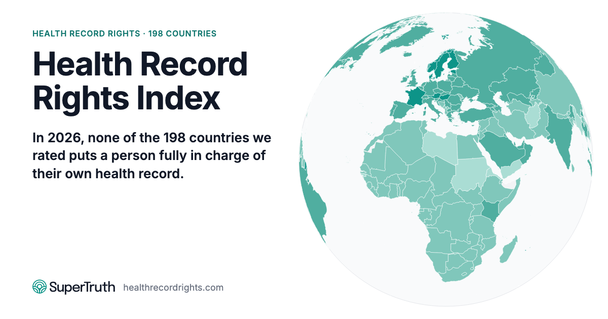
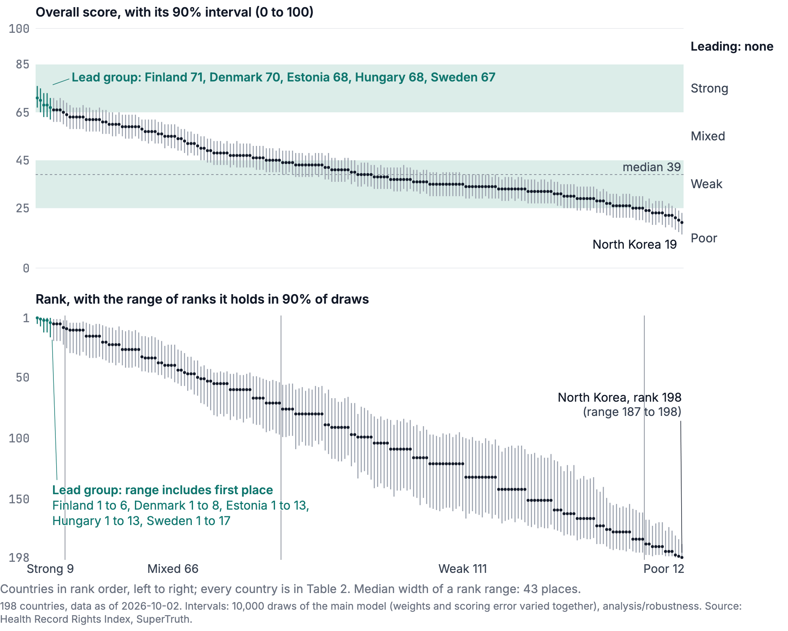
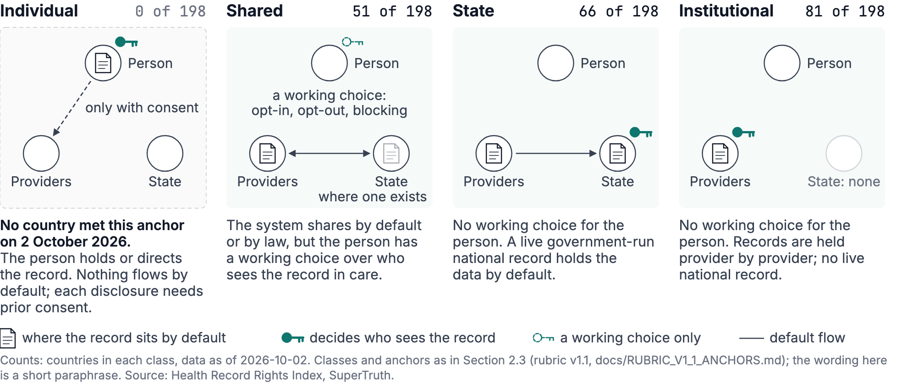
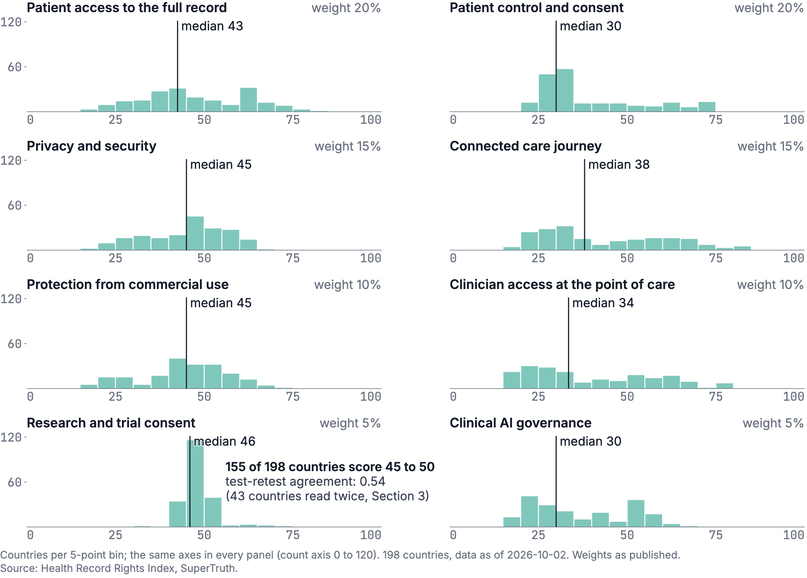
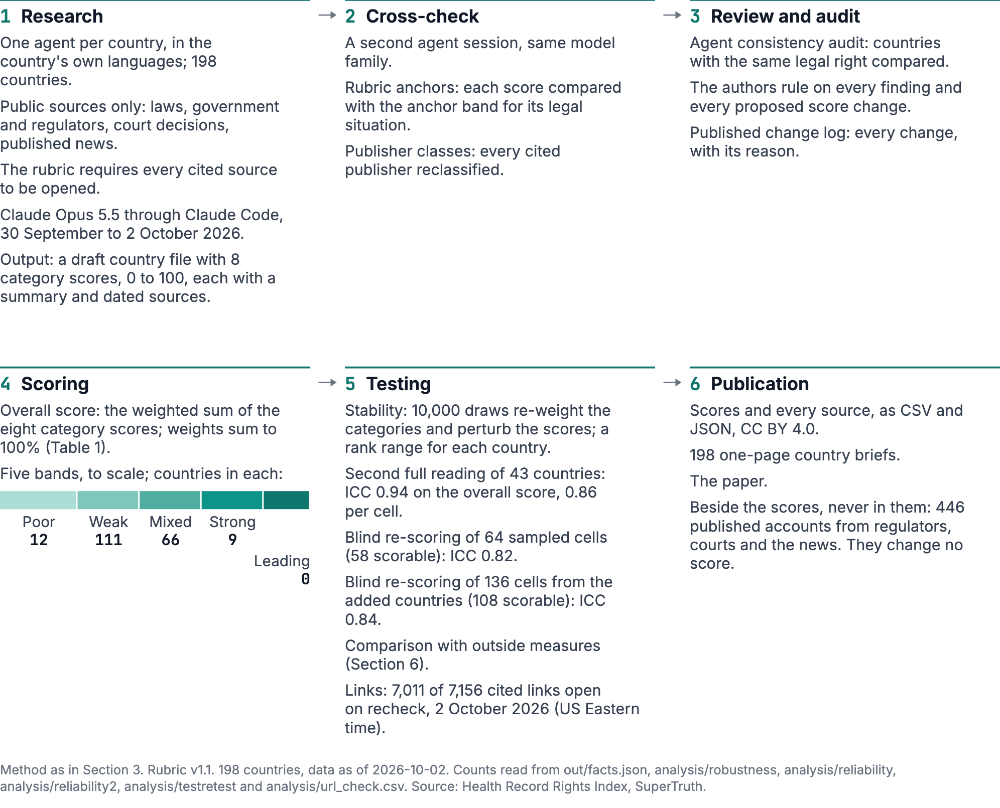
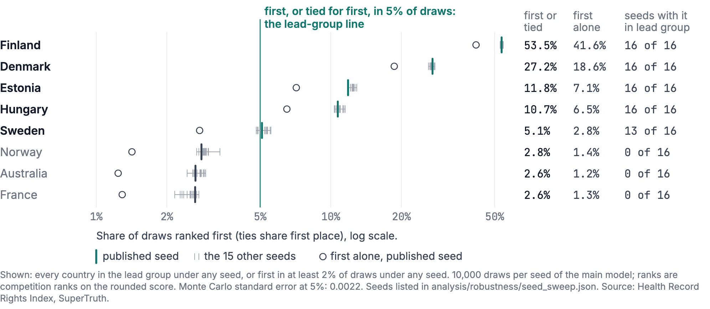
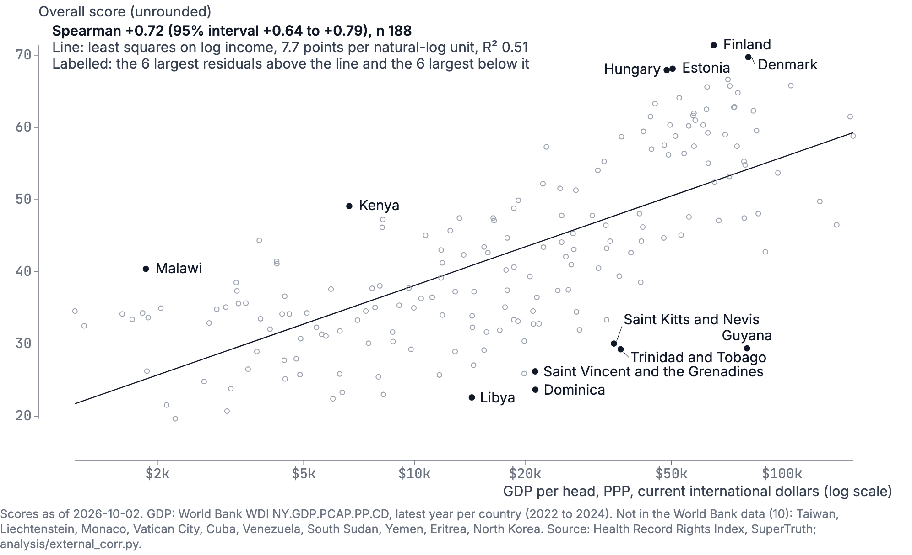
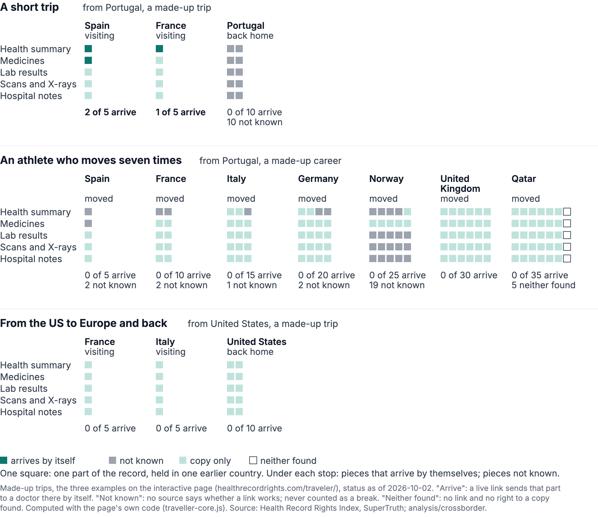
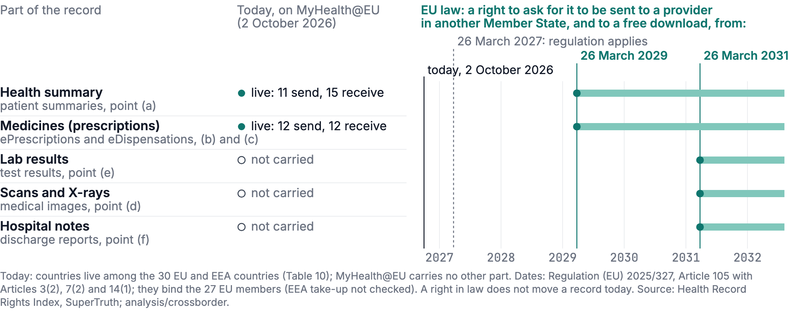

# Health Record Rights Index

**Who holds the record?** An open index that scores 198 countries and territories, from 0 to 100, on one question: can a person see, control and share their own health record?

By SuperTruth Inc. Version 1.0, data as of 2 October 2026. Data and paper CC BY 4.0, code MIT.

- **Live index:** https://healthrecordrights.com
- **Paper:** [`paper/paper.pdf`](paper/paper.pdf) (working paper, source in [`paper/paper.md`](paper/paper.md))
- **Data:** [`data/`](data/) (one file per country) and [`exports/`](exports/) (CSV and JSON)



## The finding

In 2026, none of the 198 countries and territories we rated puts a person fully in charge of their own health record.

- **No country holds the top band.** No country reaches Leading (85 and up). By band, 9 rate Strong, 66 Mixed, 111 Weak and 12 Poor. The median is 39.
- **The leaders are a group, not a winner.** Finland, Denmark, Estonia, Hungary and Sweden have the highest scores. Allowing for scoring error, any of them could rank first, so we name them together.
- **Someone else holds the keys everywhere.** By default the record sits with the state or with providers: 51 systems are Shared (the person has a working choice inside a shared system), 81 Institutional and 66 State. None is Individual.
- **Ranks are ranges.** Every country carries the range of ranks it holds in 90% of simulations. Read those, not single positions.

Coverage: all 193 UN member states, plus Greenland, Kosovo, Palestine, Taiwan and Vatican City. Including a place takes no position on its status; we cover every place that runs its own health system.

## Top 10

| Rank | Likely range | Country | Score | Band |
|---:|---:|---|---:|---|
| 1 | 1 to 6 | Finland | 71 | Strong |
| 2 | 1 to 8 | Denmark | 70 | Strong |
| 3= | 1 to 13 | Estonia | 68 | Strong |
| 3= | 1 to 13 | Hungary | 68 | Strong |
| 5 | 1 to 17 | Sweden | 67 | Strong |
| 6= | 2 to 20 | Australia | 66 | Strong |
| 6= | 2 to 20 | France | 66 | Strong |
| 6= | 2 to 20 | Norway | 66 | Strong |
| 9 | 3 to 23 | Austria | 65 | Strong |
| 10 | 3 to 26 | Portugal | 64 | Mixed |

Other large systems: Germany 63 (11=), the Netherlands 60 (23=), the United Kingdom 59 (27=), Japan 56 (38=), Canada and Brazil 52 (47=), the United States 48 (55=, likely 45 to 80), India 45 (71=), China 43 (80=). The full ranking is in [`exports/who-holds-the-record-scores.csv`](exports/who-holds-the-record-scores.csv) and Table 2 of the paper.



*Every country in rank order. The lower panel draws each country's rank range; the upper panel adds the score intervals behind them. No country reaches Leading.*

## What we measure

Eight weighted categories, each scored 0 to 100 against a written rubric ([`RUBRIC.md`](RUBRIC.md)):

| Category | Weight |
|---|---:|
| Patient access to the full record | 20% |
| Patient control and consent | 20% |
| Privacy and security | 15% |
| Connected care journey | 15% |
| Protection from commercial use | 10% |
| Clinician access at the point of care | 10% |
| Research and trial consent | 5% |
| Clinical AI governance | 5% |

The overall score is the weighted sum. The weights are the authors' judgment; the paper tests how much the ranking depends on them. Each country is also placed in one of four classes for who holds the keys by default:





*Which rights lag. Patient control and clinical AI governance sit lowest; research consent heaps just below the middle of the scale, which is why it barely separates countries.*

## How it was built



1. **Research.** One research agent per country, in the country's own languages, using public sources only: laws, government and regulator pages, court decisions and published news. The rubric requires every cited source to be opened. The agents are built on Anthropic's Claude (Claude Opus 5.5 through Claude Code, 30 September to 2 October 2026). The paper discloses this in full.
2. **Cross-check.** A second agent session of the same model family checks each country file against the rubric anchors and against peer countries with the same legal situation.
3. **Review and audit.** Agents audit consistency across countries; the authors rule on every finding and every score change, and every change is logged in [`docs/SCORE_CHANGES.md`](docs/SCORE_CHANGES.md).
4. **Scoring.** Weighted sum, then five bands.
5. **Testing.** Ranking stability (10,000 simulations), two blind re-scorings, a full second reading of 43 countries, comparison with outside measures, and a link check of every cited source.
6. **Publication.** Scores, every source, a one-page brief per country, and the paper.

Everything comes from public information: 5,147 cited sources. Of 7,156 cited links, 7,011 opened on recheck on 2 October 2026; 88 were blocked by bot protection and 57 did not answer. No link was dead.

## How far to trust it

We published the checks against ourselves, including the ones that do not flatter us.

- **Two blind re-scorings.** Separate agent sessions re-scored random samples of cells from the cited sources alone, without seeing our scores or our site. On the first 65 countries, agreement was 0.82 (intraclass correlation). On a pre-registered sample of 136 cells from the 133 countries added on 2 October, agreement was 0.84. Access to the record agreed least (0.68), mostly where the rater could not open a cited law text, so a single access score for an added country is not reproducible to the point.
- **No human rater has scored the index yet.** That is the next step.
- **The lead group is on a rule set before the results.** A country is in it if it ranks first, alone or tied, in at least 5% of simulations. Sweden is on the edge: 5.09% under the published run, 13 of 16 random seeds, and 2.8% if ties are not counted.



- **Confidence labels follow a printed rule.** High means at least 7 of 8 categories rest on an official source with no fact marked unchecked; low means 4 or more do not. 27 countries are high, 105 medium and 66 low. The label is about the evidence, not the country's rights, and it never changes a score.
- **Income matters but does not decide.** Richer countries score higher, and income explains about half of the spread, but not all of it.



## The traveling patient

Does your record follow you across a border? The live page at https://healthrecordrights.com/traveler/ lets you pick where you live and a trip, and shows which of the five parts of your record (health summary, medicines, lab results, scans and X-rays, hospital notes) reach a doctor in each country by themselves, and which you would have to carry as a copy.

- Of 702 one-way routes between EU countries, a health summary travels by itself on 143.
- No source says the EU's cross-border service also works for people who move, not just visit.
- 138 of 198 countries give a person a right to a copy of their record.
- EU law adds a right to ask for each part to be sent to another member state: the health summary and medicines from 26 March 2029, the rest from 26 March 2031. A right in law does not move a record today.





## What is in this repository

| Path | What it holds |
|---|---|
| [`data/`](data/) | One JSON file per country: the eight category scores with summaries and detail, the laws, who holds the keys, and every cited source with its date |
| [`exports/`](exports/) | The same data as CSV and JSON for analysis |
| [`RUBRIC.md`](RUBRIC.md) | The scoring rubric, its anchors and the confidence rule |
| [`DECISION_RULES.md`](DECISION_RULES.md) | The rules the build enforces, each with its check (for example, no sole first place unless it holds in 95% of simulations) |
| [`docs/`](docs/) | Score change log, stories rules, evidence grade method |
| [`paper/`](paper/) | The working paper (PDF and Markdown), its stylesheet, build script and figures |
| [`analysis/robustness/`](analysis/robustness/) | Ranking stability, lead-group rule and the seed sweep |
| [`analysis/reliability/`](analysis/reliability/), [`analysis/reliability2/`](analysis/reliability2/) | The two blind re-scoring studies: plans with their hashes, rater kits, samples, ratings, results and reports |
| [`analysis/external/`](analysis/external/) | Comparisons with the WHO Global Digital Health Monitor, Eurostat and income |
| [`analysis/crossborder/`](analysis/crossborder/) | Cross-border record exchange and copy rights behind the traveling patient |
| [`analysis/confidence/`](analysis/confidence/), [`analysis/dti/`](analysis/dti/), [`analysis/variance/`](analysis/variance/), [`analysis/strain/`](analysis/strain/) | Confidence labels, evidence grades, variance structure, health system strain |
| [`analysis/literature/`](analysis/literature/) | Literature review |
| [`scripts/`](scripts/) | Paper generation (every number in the paper is computed, never typed), figure generators, checks and tests |
| `build.js`, `template.html`, `brief.js`, `presskit.js`, `nav.js`, `traveller*.js` | The code that builds the site from the data |

## Reproduce it

```sh
npm install
node build.js                  # builds the site into out/
node scripts/paper_gen.js      # recomputes every number in the paper; refuses stale inputs
zsh paper/build.sh             # builds paper/paper.pdf (needs pandoc and Chrome)
```

The paper generator checks a hash of the data against every analysis output and stops if any figure was computed on older data.

One limit: the published accounts (the stories layer) are not in this repository, so that removal requests can be honoured. `build.js` runs without them and leaves the stories out; `paper_gen.js` needs them for Section 5's counts and will not run from this repository alone. Every score, rank and analysis rebuilds from what is here.

## How to cite

Snyder, J. A., Hill, R. P., IV, & Raney, D. (2026). *The Health Record Rights Index: Who Holds the Record in 198 Countries?* (version 1.0). SuperTruth Inc. https://healthrecordrights.com/

Paper: https://doi.org/10.5281/zenodo.23120175 · Data: https://doi.org/10.5281/zenodo.23120173

Citation metadata is in [`CITATION.cff`](CITATION.cff). The three authors share equal credit.

## Licences

- **Data, scores and paper:** [CC BY 4.0](https://creativecommons.org/licenses/by/4.0/). Credit SuperTruth and link the index.
- **Code:** MIT (see [`LICENSE`](LICENSE)).
- The SuperTruth name and logos in `brand/` are trademarks of SuperTruth Inc. and are not covered by either licence.

## Disclosure and corrections

SuperTruth sells health data verification products, and the authors are its officers. imaware, an affiliate of SuperTruth, provides testing services under agreements with some US state governments; the index scores the United States as one country and scores no state separately. We built this index and chose its stories ourselves. No government, health system, company or person paid to be included or had any say in the scores.

**Press and interviews:** Rheanna Crescenzo, press@supertruth.ai

This is a research tool, not legal advice. If we got a country wrong, open an issue with the page that shows it and we will fix it in the open.

The published accounts of record problems shown on the site are not deposited here, so that a removal request can be honoured; each links to its public source on the site.
