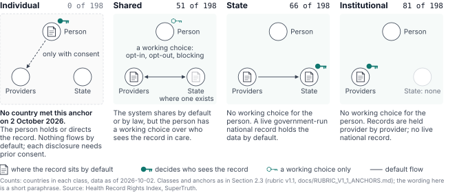
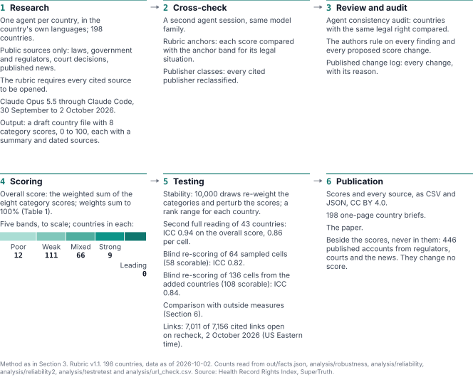
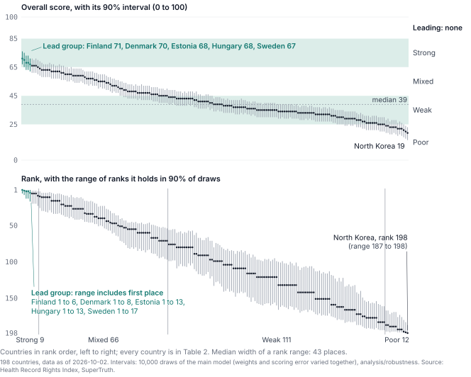
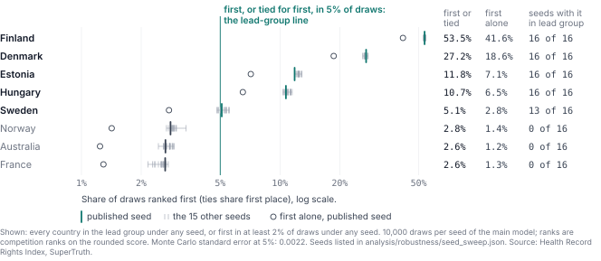
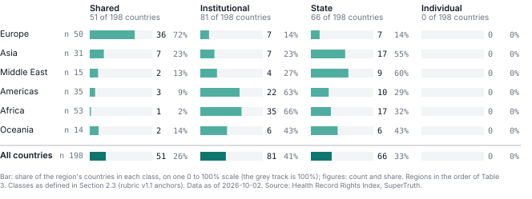
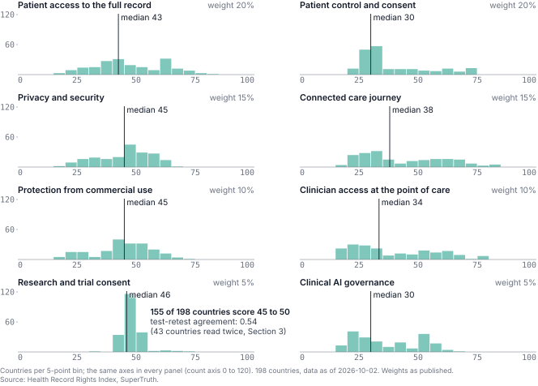
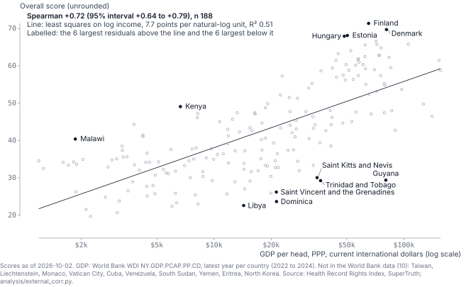
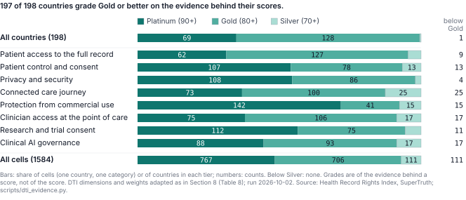
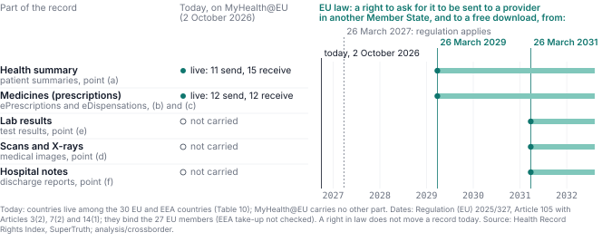
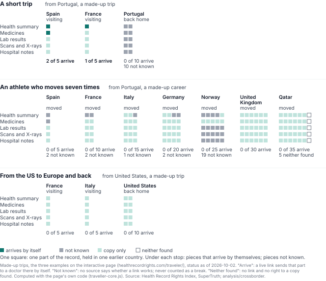

# The Health Record Rights Index: Who Holds the Record in <!-- GEN:n -->198<!-- /GEN:n --> Countries?

**Jason Alan Snyder**¹, **Bobby Hill**¹, **Dustin Raney**¹

¹SuperTruth Inc., United States. J. A. Snyder ORCID 0009-0001-6157-8100.

**Status:** Working paper, version 1.0, not peer reviewed. 2 October 2026.

**Correspondence:** through the SuperTruth contact form, https://supertruth.ai/on-the-record#contact

**Submitted:** October 2026 · **Version:** <!-- GEN:version -->1.0<!-- /GEN:version --> · **Data as of:** <!-- GEN:asof -->2026-10-02<!-- /GEN:asof -->

**DOI:** https://doi.org/10.5281/zenodo.23120175 (data: https://doi.org/10.5281/zenodo.23120173). **Interactive index:** https://healthrecordrights.com

---

<!-- Every number between GEN markers is spliced by scripts/paper_gen.js from the repository's computed outputs (out/facts.json, data/, stories/, analysis/); do not hand-edit those spans. -->

## Abstract

We scored <!-- GEN:n -->198<!-- /GEN:n --> countries and territories (<!-- GEN:uncoverage -->all 193 UN member states, plus Greenland, Kosovo, Palestine, Taiwan and Vatican City<!-- /GEN:uncoverage -->) from 0 to 100 on one question: does a person get to see, control and share their own health record? Eight weighted categories cover access to the full record, control and consent, privacy and security, protection from commercial use, a connected care journey, clinician access at the point of care, research consent, and clinical AI governance. Research agents built on Anthropic's Claude models did the research and scoring against a written rubric, and the authors ruled on every finding and every change. The rubric requires an agent to open every source it cites; a later check of every cited link found <!-- GEN:links -->7156 cited links checked: 7011 opened, 0 dead (HTTP 404 or 410), 88 blocked by bot protection and 57 unreachable, unresolved or answering with a server error<!-- /GEN:links -->. Every score cites the public pages it rests on: <!-- GEN:sources -->5147 cited sources (978 undated)<!-- /GEN:sources -->. <!-- GEN:lead -->Finland (71), Denmark (70), Estonia (68), Hungary (68) and Sweden (67) have the highest scores; allowing for scoring error, each of them is first, alone or tied, in at least 5% of draws<!-- /GEN:lead -->. The median is <!-- GEN:median -->39<!-- /GEN:median -->, and scores track national income closely: Spearman <!-- GEN:incrho -->+0.72 (95% interval +0.64 to +0.79, n 188)<!-- /GEN:incrho -->. By band, with the range each count takes when weights and scores are varied: <!-- GEN:bandranges -->9 Strong (7 to 14 across draws), 66 Mixed (58 to 72), 111 Weak (101 to 115) and 12 Poor (10 to 19)<!-- /GEN:bandranges -->. <!-- GEN:rbextremes -->No country reaches the top band in any draw; 12 countries are Poor as published (10 to 19 across draws)<!-- /GEN:rbextremes -->. A blind re-scoring of <!-- GEN:reln -->58<!-- /GEN:reln --> sampled cells from the first <!-- GEN:relframen -->65<!-- /GEN:relframen --> countries by a separate session of the same model family, run before the 2 October re-research, agreed with the scores at that time at an intraclass correlation of <!-- GEN:reliccshort -->0.82<!-- /GEN:reliccshort -->, and a second, of <!-- GEN:rel2n -->108<!-- /GEN:rel2n --> cells from the <!-- GEN:nadded -->133<!-- /GEN:nadded --> countries added on 2 October 2026, at <!-- GEN:rel2iccshort -->0.84<!-- /GEN:rel2iccshort -->, though single access scores there agree less well (<!-- GEN:rel2accessshort -->0.68<!-- /GEN:rel2accessshort -->); no human rater has scored the index. A single cell can move by about <!-- GEN:relloahalf -->17<!-- /GEN:relloahalf --> points. Once a country's scoring error and the weights are both allowed for, a country's likely rank typically spans <!-- GEN:rbmainwidth -->43<!-- /GEN:rbmainwidth --> places. Confidence labels are computed from each country file by a fixed rule: <!-- GEN:confsplit -->27 high, 105 medium and 66 low<!-- /GEN:confsplit -->. We also classed where control over the record sits by default, which we call who holds the keys: <!-- GEN:models -->51 Shared, 81 Institutional and 66 State; 0 Individual<!-- /GEN:models -->. No country gives the person the default say over who sees the record; our definition of that class requires that nothing flow into a state or provider system by default, which no national system does. An audit of our own scores found that the same legal situation was sometimes scored differently in different regions. We tightened the rubric, rescored, and report every change. A separate context layer, which changes no score, asks whether strained public systems push care to private providers whose records do not reach the public record. Alongside the scores we collected <!-- GEN:storytotal -->446<!-- /GEN:storytotal --> published accounts of real problems with health records. They illustrate the scores and do not change them. The paper and data are released under CC BY 4.0 and the code under the MIT licence.

**Keywords:** health records, patient access, consent, health data governance, interoperability, European Health Data Space, HIPAA, GDPR, clinical AI governance, composite index

---

## 1. Why this question

A health record follows a person through every part of care: the family doctor, the hospital, the lab, the pharmacy, the insurer, public health and research. Each party in that chain sees its own part. Clinicians see the records their own service holds. Insurers see claims. Governments see registries. In our view the person whose record it is often sees least: a portal, a summary, or a photocopy that took weeks to arrive. The index measures how far that is true, country by country.

Clinical AI raises the stakes. Systems that read records to suggest diagnoses, summarise notes or triage patients are only as good as the record they read. In our view, which this paper does not test, the person whose record it is usually has the least say in how it is used, and the least ability to find out what it contains.

We wanted one comparable answer, country by country, to a plain question: does a person get to see, control and share their own health record? Most existing indices measure the digital maturity of health systems, as reported by governments. The Euro Health Consumer Index and an earlier patient empowerment report scored record access as one item among many (Section 6). We set out to measure the patient's side as the object of the index: the right in law and, where published evidence allows, whether it works in practice. Law alone is not enough: England's care.data programme failed although it was lawful, because it lacked public trust [52]. We did not measure practice directly: no record requests, patient surveys or tests.

## 2. What we measured

### 2.1 Eight categories

Each country receives a score from 0 to 100 in eight categories. The overall score is their weighted average. The weights are the authors' judgment. Access and control carry the largest printed weights because they are the core of the question. Printed weights are not the same as influence on the ranking: Table 1b, after the category definitions, shows how much each category actually moves the overall score.

<!-- GEN:categories -->

| Category | Weight | Min | Q1 | Median | Q3 | Max |
|---|---:|---:|---:|---:|---:|---:|
| Patient access to the full record | 20% | 15 | 35 | 43 | 60 | 80 |
| Patient control and consent | 20% | 20 | 28 | 30 | 47 | 74 |
| Privacy and security | 15% | 15 | 35 | 45 | 52 | 65 |
| Connected care journey | 15% | 18 | 28 | 38 | 58 | 82 |
| Protection from commercial use | 10% | 15 | 35 | 45 | 52 | 70 |
| Clinician access at the point of care | 10% | 15 | 23 | 34 | 54 | 78 |
| Research and trial consent | 5% | 30 | 45 | 46 | 49 | 70 |
| Clinical AI governance | 5% | 15 | 22 | 30 | 50 | 66 |

<!-- /GEN:categories -->

*Table 1. The eight categories, their weights, and the distribution of scores across all countries (minimum, quartiles, median, maximum).*

1. **Patient access to the full record.** The legal right to see and copy the whole record (notes, labs, imaging reports, history), and the practical reality: a national portal or not, summary or full record, how many years, cost and time limits, machine-readable export.
2. **Patient control and consent.** Whether the person decides who sees and uses their data, with granular and revocable choices; whether they can see who accessed it; whether the default is individual or institutional control.
3. **Privacy and security.** Health data's legal status, breach notification, penalties, regulator independence and enforcement, major breaches, state access exceptions.
4. **Connected care journey.** Infrastructure that links the record across primary care, hospitals, labs, pharmacy, claims, public health and research, and how much it is used.
5. **Protection from commercial use.** Limits on selling health data or using it for marketing, data brokers, consumer health apps outside health law, sale of de-identified data. A high score means strong protection.
6. **Clinician access at the point of care.** Whether the treating clinician can see the patient's complete record across providers when needed, under consent and emergency rules.
7. **Research and trial consent.** Ethical, consent-based secondary use; transparency; trial consent law. A high score means the person's choice is respected and research is still possible.
8. **Clinical AI governance.** Rules for AI used in care: device regulation, change control, transparency, data provenance, human oversight, rules for generative AI.

The eight categories move together. Across all <!-- GEN:n -->198<!-- /GEN:n --> countries the first principal component of the eight scores carries <!-- GEN:pc1 -->70%<!-- /GEN:pc1 --> of their variance. Table 1b gives each category's share of the variation in overall scores: its weight times its covariance with the overall score, divided by the variance of the overall score, so the shares sum to 100%. Access and control together account for <!-- GEN:effaccess -->43.6%<!-- /GEN:effaccess -->. The connected care journey and clinician access, which measure infrastructure, account for <!-- GEN:effinfra -->31.6%<!-- /GEN:effinfra -->, so the ranking is driven by infrastructure about as much as by access. Research consent, printed at 5%, accounts for <!-- GEN:effres -->0.7%<!-- /GEN:effres -->: it contributes almost nothing to the ranking (Section 4.4). We keep the eight categories separate as a reporting choice, so that a reader can see each one, not as eight independent pieces of evidence.

<!-- GEN:efftable -->

| Category | Printed weight | Share of the variation in overall scores | SD | IQR |
|---|---:|---:|---:|---:|
| Patient access to the full record | 20% | 22.1% | 15.1 | 25 |
| Patient control and consent | 20% | 21.5% | 15.0 | 19 |
| Privacy and security | 15% | 11.3% | 11.7 | 17 |
| Connected care journey | 15% | 19.0% | 17.6 | 30 |
| Protection from commercial use | 10% | 8.6% | 12.5 | 17 |
| Clinician access at the point of care | 10% | 12.6% | 17.7 | 31 |
| Research and trial consent | 5% | 0.7% | 4.3 | 4 |
| Clinical AI governance | 5% | 4.3% | 13.7 | 28 |

<!-- /GEN:efftable -->

*Table 1b. Printed weights against each category's share of the variation in overall scores, with the standard deviation (SD) and interquartile range (IQR, from Table 1) of each category across all countries (analysis/variance/variance.py).*

### 2.2 Bands

Scores map to five bands, anchored in the rubric: **Leading** (85 to 100): the right exists in law and works in practice at national scale, with controls the patient can see. **Strong** (65 to 84): the right exists and mostly works, with notable gaps. **Mixed** (45 to 64): partial rights or partial infrastructure. **Weak** (25 to 44): rights mostly on paper, or a fragmented record. **Poor** (0 to 24): no meaningful right or infrastructure, or active misuse. "Works in practice" is read from published evidence; we did not measure practice directly (Section 1).

### 2.3 Who holds the keys

Separately from the score, each country is classed by where control sits by default. The classes were given written anchors on 2 October 2026 (docs/RUBRIC_V1_1_ANCHORS.md) and applied to every country in order:

- **Individual:** the record is held or directed by the person, nothing flows into a state or provider system by default, and every disclosure needs the person's prior, revocable consent, with a log the person can read.
- **Shared:** the system shares by default or by law, but the person has at least one working choice over who sees the record in care (opt-in, opt-out, or blocking named providers or items), in force for the general population. An access log alone is visibility, not control, and a research opt-out alone does not count.
- **State:** no such working choice, and a live government-run national record or exchange used for care holds the data by default.
- **Institutional:** no such working choice, and records are held provider by provider with no live national record of that kind.

*Figure 1. Who holds the keys: the four classes of Section 2.3, drawn as the person, providers and the state. The document marks where the record sits by default, a solid key who decides who sees it, a dashed key a working choice only, and the arrow which way the record flows by default. No country met the Individual anchor.*

Applying the anchors in the review round of 2 October 2026 changed <!-- GEN:round2keys -->Cyprus (Shared to State), Greece (Shared to State) and Indonesia (Shared to State)<!-- /GEN:round2keys -->; the re-research of the first <!-- GEN:norig -->43<!-- /GEN:norig --> countries the same day changed <!-- GEN:trkeysn -->6<!-- /GEN:trkeysn --> more: <!-- GEN:trkeys -->Argentina (Institutional to Shared), United Kingdom (State to Shared), Ireland (Institutional to State), Japan (Institutional to Shared), Kenya (State to Shared) and New Zealand (Institutional to Shared)<!-- /GEN:trkeys -->. The class and the control score measure different things and can disagree: a State country with a strong log the patient can see can outscore a Shared country with a weak choice.

### 2.4 What "rights" means here

In the title, rights means what a person is entitled to over their own record and whether they can use it. Five categories score entitlements in law: access, control, privacy, protection from commercial use and research consent. Three score what a state or health system has built: the connected care journey, clinician access and clinical AI governance. We call those three delivery. They are in the overall score because a right a person cannot use is worth less, and the OECD's own country survey reports health data infrastructure and governance together [59]. The line is not clean: access and control also give credit for a national portal or a consent register, which are infrastructure. Section 4.6 reports a rights sub-score and a delivery sub-score separately, with the income link of each. They are a supplementary decomposition for this paper; the interactive index and Table 2 use the overall score.

## 3. How we scored

*Figure 2. How the index was built, in six stages. Every count in the figure is read from the repository (scripts/fig_method_print.js).*

**Countries.** <!-- GEN:n -->198<!-- /GEN:n --> countries and territories across <!-- GEN:nregions -->6<!-- /GEN:nregions --> regions: <!-- GEN:uncoverage -->all 193 UN member states, plus Greenland, Kosovo, Palestine, Taiwan and Vatican City<!-- /GEN:uncoverage -->. The first <!-- GEN:norig -->43<!-- /GEN:norig --> were chosen to cover every inhabited region and the largest health systems; they were researched in the index's first version and re-researched in full on 2 October 2026. <!-- GEN:nwave1 -->21<!-- /GEN:nwave1 --> countries were added on 1 October 2026, mostly to complete the European Union, and <!-- GEN:latenames -->Albania<!-- /GEN:latenames --> on 2 October. On 2 October <!-- GEN:nwave2 -->48<!-- /GEN:nwave2 --> more were added, then <!-- GEN:nwave3 -->81<!-- /GEN:nwave3 -->, then <!-- GEN:observernames -->Palestine and Vatican City<!-- /GEN:observernames -->, so that the index covers every UN member state, and last <!-- GEN:grlxkxnames -->Greenland and Kosovo<!-- /GEN:grlxkxnames -->, included because each runs its own health system. Greenland, part of the Kingdom of Denmark, makes its own health law, such as a 2001 ordinance on patients' rights and a 2024 act of its parliament, Inatsisartut, on patient complaints and compensation; the Danish Act on Greenland Self-Government of 2009 gives Greenland law-making and executive power in the fields it has taken over, and still lists the remaining parts of the health field as ones it may take over from Denmark [33][34][35]. Kosovo's health system rests on Law No. 04/L-125 on Health, passed by its Assembly, in force since May 2013 and amended in 2022 and 2023 [36]. Every added country went through the same three steps: research in the country's own languages with primary sources first, an adversarial cross-check of the file by a second agent session of the same model family, and a search for published accounts (Section 5). Names follow our country files; listing a place separately reflects a separate health system and law and implies no position on its status. Regions are our own grouping for reading the tables (Turkey, Russia, Ukraine and Albania are in Europe; Israel is in the Middle East), not a political classification.

**Use of AI.** We report this following the 2025 position statement of Cochrane, the Campbell Collaboration, JBI and the Collaboration for Environmental Evidence, which asks authors to name the AI system, its version and the dates used, the purpose, and how its output was validated [22].

- *System and dates.* Research agents built on Anthropic's Claude models (Claude Opus 5.5, run through Claude Code), used from 30 September to 2 October 2026.
- *What the agents did.* Research and scoring of every country against the written rubric; a cross-check of each country's research by a second agent session, which reclassified every cited publisher, rechecked every link and compared each score with the anchor band for its legal situation; the consistency audit (Section 7); collection and first review of the accounts (Section 5); the outside research for the context layer (Section 9); the reading of the X sample (Section 11); the blind re-scoring below; and drafting of this paper.
- *What the authors did.* The authors directed the research, ruled on every audit finding and every proposed score change, and reviewed and revised the text. Each ruling is recorded with its evidence in docs/SCORE_CHANGES.md. We do not claim that a person read every cell and every source.
- *How the output was checked.* A link check of every cited URL (the figures in the abstract). A verifier for the accounts, tested by planting eight rule violations, all caught. A verifier for the stability analysis, tested with planted bugs (wrong rounding, swapped weights, a score off by one). A verifier of the blind re-scoring transcripts, tested with 13 planted breaches of the blind, all caught. The cross-check of each country's research by a second agent session of the same model family, which could see the first session's scores. A blind re-scoring of a random sample of cells, reported below. The checking agents run on the same model family as the research agents, so these checks are independent readings, not independent judges; Section 7.4 sets out what that limits.

The rubric requires that every number and law name come from a page the agent opened, and that a fact which could not be verified be marked "not verified" in the text. Each country file's `asOf` is the date the file was last checked; dates run from <!-- GEN:asofrange -->2026-10-01 to 2026-10-02<!-- /GEN:asofrange -->.

**Evidence.** Each category cites one to four sources, most of them dated, and each source carries its publisher class (law text, government or regulator, intergovernmental body, academic, news, law firm, blog or vendor). Each country also lists its key laws, a care-journey map (each of seven stages marked connected, partial, siloed or unknown), and recent news items.

**Confidence.** Each label is computed from the country file by a script (scripts/confidence.py), never set by hand, and the script that fills this paper refuses a label the rule does not give. A category is weak when it cites no primary source (law text, government, regulator or intergovernmental body) or when its text admits that a fact was not verified, matched on a fixed set of wordings ("not verified", "unverified", "could not verify", "could not confirm", "not confirmed", "did not verify", "no verified" and similar). A country is high confidence when 7 or 8 of its categories cite a primary source and none admits an unverified fact, low when 4 or more of its 8 categories are weak, and medium otherwise. The low tier was defined on 2 October 2026, before any label was recomputed. Until then the labels were stored fields written by agents: a reviewer found that many "high" countries carried the wording the printed rule says caps a label at medium, and that the source count alone no longer separated countries (<!-- GEN:confallprim -->177<!-- /GEN:confallprim --> countries cite a primary source in all eight categories). Labels now: <!-- GEN:confsplit -->27 high, 105 medium and 66 low<!-- /GEN:confsplit -->; before: <!-- GEN:confbefore -->70 high, 128 medium and 0 low<!-- /GEN:confbefore -->. Only <!-- GEN:confhighkept -->27 of the 70<!-- /GEN:confhighkept --> countries then labelled high keep the label. <!-- GEN:confadmit -->171<!-- /GEN:confadmit --> countries have at least one category whose text admits an unverified fact. The publisher classes behind the count were assigned by agents and domain rules, and the cross-check reclassified every cited publisher. The label measures how much of a file rests on official sources and on facts the research says it verified; it does not measure how much is known about practice, and a law text can make a category primary where nothing is known about how it works. <!-- GEN:lowconfn -->66<!-- /GEN:lowconfn --> countries are low confidence: <!-- GEN:lowconf -->Albania, Algeria, Antigua and Barbuda, Argentina, Azerbaijan, Bahamas, Bahrain, Bangladesh, Barbados, Bosnia and Herzegovina, Bulgaria, Cambodia, Cape Verde, Croatia, Cuba, El Salvador, Equatorial Guinea, Eritrea, Ethiopia, Fiji, Greece, Greenland, Grenada, Guatemala, Guinea, Guinea-Bissau, Haiti, India, Iran, Iraq, Kazakhstan, Kenya, Kiribati, Kosovo, Kuwait, Marshall Islands, Mauritania, Micronesia, Moldova, Monaco, Mongolia, Montenegro, Morocco, Nauru, Nepal, Oman, Palau, Palestine, Peru, Qatar, Romania, Russia, San Marino, Sao Tome and Principe, Saudi Arabia, Serbia, Sierra Leone, Slovenia, Sri Lanka, Syria, Tonga, Turkey, United Arab Emirates, Uzbekistan, Vanuatu, Zambia<!-- /GEN:lowconf -->.

**Same regime, same band.** Rubric v1.1 adds sub-anchors so that the same legal situation lands in the same band wherever it is. For example, a statutory right to a copy with no national portal starts at 45 on access, gains 5 for a free right with a statutory deadline or a structured format, and loses 5 each for a fee, no deadline, a limited scope or a right not yet enforceable. In EU and EEA states the GDPR's one-month deadline (extendable by two further months) and free first copy bind by law, so that step is credited whatever the cited national page says. Export in a structured format is not an EU-wide floor in the same way: the GDPR's portability right applies only where processing rests on consent or a contract, and does not apply to processing for a task carried out in the public interest (Article 20(1) and (3)) [42], which covers most public health records. A structured download becomes an EU-wide right only when EHDS Article 3(2) applies, from 2029 [5]. An EU country with only EU law on clinical AI scores 50, plus 4 for each verified national addition. Research use without consent or opt-out starts at 40 and gains 3 for each documented safeguard, up to 50. If a key fact could not be verified, the score stays in the lower half of its band and earns nothing from that fact.

**Precision.** <!-- GEN:fivepct -->871 of 1584 category scores (55%)<!-- /GEN:fivepct --> are multiples of five: scores cluster there, which shows how numbers were chosen rather than how precise they are. The blind re-scoring below measures precision directly. We use competition ranking: tied countries share a rank, shown as "4=", and ties are taken on the displayed whole number.

**How far a second reading agrees.** To test whether the scores depend on who does the scoring, we drew a stratified random sample of <!-- GEN:relsample -->64<!-- /GEN:relsample --> of the 520 country-category cells then in the index (65 countries) (8 per category, regions in proportion to country count, fixed seed). A fresh agent session re-scored each one blind. It saw only the rubric, the anchor rules with every country-specific score removed, the country, the category and the cell's cited sources. The analysis plan was written and hashed before any cell was scored. The rater ran on <!-- GEN:reldate -->2026-10-02<!-- /GEN:reldate --> (model <!-- GEN:relmodel -->claude-opus-5-5<!-- /GEN:relmodel -->) and is compared with the scores as published at the time of the run. On the <!-- GEN:reln -->58<!-- /GEN:reln --> cells it could score, it landed on average <!-- GEN:relmad -->5.8 points (95% CI 4.3 to 7.6)<!-- /GEN:relmad --> from the published score, within 10 points in <!-- GEN:relwithin10 -->88%<!-- /GEN:relwithin10 --> of cells, with no overall bias (<!-- GEN:relbias -->-0.4<!-- /GEN:relbias --> points). The intraclass correlation (ICC(2,1), absolute agreement) was <!-- GEN:relicc -->0.82 (95% CI 0.72 to 0.89)<!-- /GEN:relicc --> and the weighted kappa on the five bands <!-- GEN:relkappa -->0.63<!-- /GEN:relkappa -->. Two agent readings of the same sources agree on ordering and level; this does not show that a human, a different model, or a rater gathering its own evidence would agree. Against the current published scores the same ratings give an intraclass correlation of <!-- GEN:relcurrent -->0.83 (95% CI 0.70 to 0.92; 25 of the 58 cells were re-researched after the run, and the rater read the earlier sources)<!-- /GEN:relcurrent -->. A single category score does not replicate to the point: the limits of agreement are <!-- GEN:relloa -->-17.7 to +16.9<!-- /GEN:relloa --> points, and <!-- GEN:relband -->38%<!-- /GEN:relband --> of cells changed band. <!-- GEN:relnull -->6<!-- /GEN:relnull --> cells could not be scored because the rater could not read their sources, and <!-- GEN:relunread -->43 of 168 (26%)<!-- /GEN:relunread --> of the cited URLs in the sample were unreadable to it, mostly PDFs; agreement was closer where every source was read. The rater shares a model family with the research agents, so this is agreement between two agent readings of the same evidence under the same rubric. It is not a human inter-rater study, and it does not test whether a rater who gathered its own evidence would agree. Agreement differs by category (exploratory, not in the plan; <!-- GEN:relcatn -->5 to 8<!-- /GEN:relcatn --> cells each): <!-- GEN:relcats -->access 0.25, research 0.54, clinical AI 0.68, clinician access 0.73, journey 0.88, commercial 0.92, privacy 0.92 and control 0.95<!-- /GEN:relcats -->. Access, which carries 20% of the weight and is the core of the question, agrees least: <!-- GEN:relaccess -->0.25 (n 8)<!-- /GEN:relaccess -->. <!-- GEN:relflag -->5<!-- /GEN:relflag --> cells differed by 15 points or more and were returned to the authors; the rulings so far are in docs/SCORE_CHANGES.md, and one (India, clinician access) awaits a ruling.

**A second full reading of 43 countries.** On 2 October 2026 the first 43 countries were researched again from scratch, which works as an unplanned test-retest of the whole pipeline, research included. Between the two readings <!-- GEN:trcells -->278 of 344 category scores in 43 countries<!-- /GEN:trcells --> changed. Agreement on single category scores (intraclass correlation ICC(2,1), absolute agreement [32]) was <!-- GEN:trcellicc -->0.86 (95% CI 0.83 to 0.89)<!-- /GEN:trcellicc -->, with limits of agreement of <!-- GEN:trloa -->-12.4 to +15.2<!-- /GEN:trloa --> points and a band change in <!-- GEN:trcellbands -->80 of 344<!-- /GEN:trcellbands --> cells. Agreement on the overall score was <!-- GEN:troverall -->0.94 (95% CI 0.90 to 0.96), Spearman 0.95<!-- /GEN:troverall -->; the largest move was <!-- GEN:trmove -->11 points<!-- /GEN:trmove -->, and <!-- GEN:trbands -->11 of 43 countries<!-- /GEN:trbands --> changed band. Agreement was <!-- GEN:trstrong -->0.86 or higher<!-- /GEN:trstrong --> in six categories but weak in <!-- GEN:trweak -->research consent (0.54) and clinical AI (0.58)<!-- /GEN:trweak -->, which together carry 10% of the weight. Two caveats make these figures an upper bound: the second reading could see the first reading's scores, so it may have anchored on them, and both readings came from the same model family. Nor was it a pure re-reading: it added primary sources and moved research cells onto the 45 to 50 anchor (docs/SCORE_CHANGES.md), and it scored higher on average, by <!-- GEN:trshift -->+1.4<!-- /GEN:trshift --> points per cell (<!-- GEN:trshiftcats -->clinical AI +4.9 and research +2.7<!-- /GEN:trshiftcats -->), where the blind study found no overall bias. The test-retest also showed that part of the scoring error is shared across a country, which the stability analysis in Section 4.2 now models.

**A blind re-score of the added countries.** Because the first blind re-scoring drew only on the first <!-- GEN:relframen -->65<!-- /GEN:relframen --> countries, we ran a second, with its own plan written, hashed and committed before any of its cells was scored (analysis/reliability2/PLAN.md): a region-stratified random sample of <!-- GEN:rel2sample -->136<!-- /GEN:rel2sample --> of the <!-- GEN:rel2framecells -->1,064<!-- /GEN:rel2framecells --> cells of the <!-- GEN:nadded -->133<!-- /GEN:nadded --> countries added on 2 October 2026, with more cells for access. Fresh agent sessions scored them under the first study's protocol, seeing only the rubric, the anchor rules with country names and scores removed, the country, the category and the cell's cited links, as in the first study, and opening nothing else. On the <!-- GEN:rel2n -->108<!-- /GEN:rel2n --> cells that could be scored, the rater landed on average <!-- GEN:rel2mad -->5.4 points (95% CI 4.4 to 6.5)<!-- /GEN:rel2mad --> from the published score, within 10 points in <!-- GEN:rel2within10 -->87%<!-- /GEN:rel2within10 --> of cells, with no overall bias (<!-- GEN:rel2bias -->-1.0 points, 95% CI -2.5 to 0.4<!-- /GEN:rel2bias -->) and an intraclass correlation of <!-- GEN:rel2icc -->0.84 (95% CI 0.77 to 0.89)<!-- /GEN:rel2icc -->, <!-- GEN:rel2iccdiff -->+0.02 (95% CI of the difference -0.10 to +0.16)<!-- /GEN:rel2iccdiff --> against the first study, <!-- GEN:rel2errorrule -->so under the pre-registered rule the added countries keep the same error term<!-- /GEN:rel2errorrule --> (cell error <!-- GEN:rel2cellsd -->5.4 points against 6.2 in the first study<!-- /GEN:rel2cellsd -->). The limits of agreement for one cell are <!-- GEN:rel2loa -->-15.9 to +13.8<!-- /GEN:rel2loa --> points. Access agreed least: intraclass correlation <!-- GEN:rel2access -->0.68 (95% CI 0.29 to 0.87, n 21)<!-- /GEN:rel2access -->, with the rater <!-- GEN:rel2accessbias -->5.9 points lower on average (95% CI -9.7 to -1.9)<!-- /GEN:rel2accessbias -->, mostly where it could not open the cited law text, often a scanned PDF, and fell back on the rule that an unverified right scores low. A single access score for an added country should not be read as reproducible to the point. The rater also spread its scores wider than ours (standard deviation <!-- GEN:rel2slope -->14.7 against 12.0; the slope of the difference on the pair mean is +0.21, p < 0.001<!-- /GEN:rel2slope -->): it went lower on low cells and higher on high ones, which the first study did not show, so our scores for the added countries sit closer to the middle of the scale than a blind reading of the same sources puts them. Of the <!-- GEN:rel2unscored -->28<!-- /GEN:rel2unscored --> cells not scored, <!-- GEN:rel2null -->20<!-- /GEN:rel2null --> had sources the rater could not read (<!-- GEN:rel2unread -->169 of 422 (40%)<!-- /GEN:rel2unread --> of the cited URLs in the sample were unreadable to it) and <!-- GEN:rel2missing -->8<!-- /GEN:rel2missing --> were lost when a rater session was excluded under the plan's transcript audit; all <!-- GEN:rel2excluded -->5<!-- /GEN:rel2excluded --> excluded sessions were false alarms of the audit script, not breaches of the blind, and no session opened our site. <!-- GEN:rel2flag -->12<!-- /GEN:rel2flag --> cells differed by 15 points or more and are with the authors for a ruling.

**What the studies cover.** The first blind study and the test-retest cover only countries among the first <!-- GEN:relframen -->65<!-- /GEN:relframen -->. The first blind sample was drawn from the <!-- GEN:relframe -->65 countries (520 cells)<!-- /GEN:relframe --> then in the index, and leans to Europe: <!-- GEN:releurope -->34 of the 58 rated cells are European and 4 African<!-- /GEN:releurope -->. The test-retest covers the first <!-- GEN:norig -->43<!-- /GEN:norig -->. The second blind study covers the <!-- GEN:nadded -->133<!-- /GEN:nadded --> countries added on 2 October 2026, <!-- GEN:naddedshare -->67%<!-- /GEN:naddedshare --> of the index, so every country now sits in the frame of one blind study. No test-retest covers the added countries, so the part of the error model in Section 4.2 that is shared across a country is carried over to them from the first <!-- GEN:norig -->43<!-- /GEN:norig -->.

**Computation.** The overall score is computed from the category scores and the published weights, in the page itself and in the build script that produced the tables in this paper. No overall score is stored or typed by hand.

## 4. Results

### 4.1 Bands first, then ranks

By band: <!-- GEN:bandranges -->9 Strong (7 to 14 across draws), 66 Mixed (58 to 72), 111 Weak (101 to 115) and 12 Poor (10 to 19)<!-- /GEN:bandranges -->. The ranges come from the stability analysis in Section 4.2. No country reaches the Leading band. <!-- GEN:lead -->Finland (71), Denmark (70), Estonia (68), Hungary (68) and Sweden (67) have the highest scores; allowing for scoring error, each of them is first, alone or tied, in at least 5% of draws<!-- /GEN:lead -->; <!-- GEN:bottom -->North Korea (19) is last<!-- /GEN:bottom -->. The median is <!-- GEN:median -->39<!-- /GEN:median -->.

Table 2 gives each country's rank with the range of ranks it holds in 90% of draws. Read the range, not the single rank. Two countries whose ranges overlap should not be called different.

*Figure 3. Every country in rank order. The lower panel draws Table 2's rank ranges; the upper panel adds the score intervals behind them. Only the lead group and the last-ranked country are labelled; look up any other country in Table 2. Bands are the labelled zones, and no country reaches Leading.*

<!-- GEN:ranking -->

| Rank | Rank range (90%) | Country | Region | Keys | Overall | Band | Confidence |
|---|---|---|---|---|---:|---|---|
| 1 | 1 to 6 | Finland | Europe | Shared | 71 | Strong | high |
| 2 | 1 to 8 | Denmark | Europe | Shared | 70 | Strong | medium |
| 3= | 1 to 13 | Estonia | Europe | Shared | 68 | Strong | medium |
| 3= | 1 to 13 | Hungary | Europe | Shared | 68 | Strong | high |
| 5 | 1 to 17 | Sweden | Europe | Shared | 67 | Strong | high |
| 6= | 2 to 20 | Australia | Oceania | Shared | 66 | Strong | medium |
| 6= | 2 to 20 | France | Europe | Shared | 66 | Strong | high |
| 6= | 2 to 20 | Norway | Europe | Shared | 66 | Strong | high |
| 9 | 3 to 23 | Austria | Europe | Shared | 65 | Strong | high |
| 10 | 3 to 26 | Portugal | Europe | Shared | 64 | Mixed | high |
| 11= | 5 to 30 | Belgium | Europe | Shared | 63 | Mixed | medium |
| 11= | 5 to 30 | Germany | Europe | Shared | 63 | Mixed | high |
| 11= | 5 to 31 | Italy | Europe | Shared | 63 | Mixed | medium |
| 11= | 5 to 32 | Taiwan | Asia | Shared | 63 | Mixed | medium |
| 11= | 4 to 29 | Turkey | Europe | Shared | 63 | Mixed | low |
| 16= | 5 to 32 | Iceland | Europe | Shared | 62 | Mixed | medium |
| 16= | 6 to 34 | Israel | Middle East | Shared | 62 | Mixed | medium |
| 16= | 7 to 34 | Latvia | Europe | Shared | 62 | Mixed | medium |
| 16= | 6 to 34 | Singapore | Asia | Shared | 62 | Mixed | medium |
| 16= | 6 to 33 | Slovenia | Europe | Shared | 62 | Mixed | low |
| 21= | 7 to 35 | Liechtenstein | Europe | Shared | 61 | Mixed | medium |
| 21= | 8 to 36 | Spain | Europe | Shared | 61 | Mixed | high |
| 23= | 9 to 38 | Croatia | Europe | Shared | 60 | Mixed | low |
| 23= | 9 to 38 | Lithuania | Europe | Shared | 60 | Mixed | medium |
| 23= | 11 to 40 | Netherlands | Europe | Shared | 60 | Mixed | medium |
| 23= | 8 to 38 | South Korea | Asia | Shared | 60 | Mixed | medium |
| 27= | 11 to 40 | Bulgaria | Europe | Shared | 59 | Mixed | low |
| 27= | 12 to 42 | Luxembourg | Europe | Shared | 59 | Mixed | medium |
| 27= | 11 to 42 | Malta | Europe | Shared | 59 | Mixed | medium |
| 27= | 12 to 42 | Poland | Europe | Shared | 59 | Mixed | medium |
| 27= | 11 to 41 | United Kingdom | Europe | Shared | 59 | Mixed | high |
| 27= | 13 to 42 | Uruguay | Americas | Shared | 59 | Mixed | medium |
| 33 | 16 to 45 | Slovakia | Europe | Shared | 58 | Mixed | medium |
| 34= | 16 to 45 | Andorra | Europe | Shared | 57 | Mixed | medium |
| 34= | 17 to 46 | Armenia | Europe | Shared | 57 | Mixed | medium |
| 34= | 16 to 46 | Czechia | Europe | Shared | 57 | Mixed | medium |
| 34= | 17 to 46 | Greece | Europe | State | 57 | Mixed | low |
| 38= | 19 to 48 | Japan | Asia | Shared | 56 | Mixed | high |
| 38= | 20 to 48 | Romania | Europe | Shared | 56 | Mixed | low |
| 40= | 24 to 51 | Cyprus | Europe | State | 55 | Mixed | medium |
| 40= | 23 to 50 | San Marino | Europe | Shared | 55 | Mixed | low |
| 40= | 23 to 51 | Serbia | Europe | Shared | 55 | Mixed | low |
| 40= | 23 to 54 | United Arab Emirates | Middle East | Shared | 55 | Mixed | low |
| 44= | 27 to 55 | Costa Rica | Americas | State | 54 | Mixed | medium |
| 44= | 28 to 57 | Switzerland | Europe | Shared | 54 | Mixed | medium |
| 46 | 30 to 57 | Saudi Arabia | Middle East | State | 53 | Mixed | low |
| 47= | 33 to 61 | Brazil | Americas | State | 52 | Mixed | medium |
| 47= | 33 to 60 | Canada | Americas | Shared | 52 | Mixed | high |
| 47= | 36 to 64 | Thailand | Asia | Shared | 52 | Mixed | medium |
| 50 | 36 to 65 | Georgia | Europe | Shared | 51 | Mixed | medium |
| 51= | 41 to 71 | Mongolia | Asia | Shared | 50 | Mixed | low |
| 51= | 40 to 72 | Qatar | Middle East | Institutional | 50 | Mixed | low |
| 53= | 43 to 74 | Kenya | Africa | Shared | 49 | Mixed | low |
| 53= | 43 to 77 | Ukraine | Europe | Shared | 49 | Mixed | medium |
| 55= | 46 to 81 | Argentina | Americas | Shared | 48 | Mixed | low |
| 55= | 46 to 82 | Azerbaijan | Asia | State | 48 | Mixed | low |
| 55= | 45 to 80 | Kazakhstan | Asia | State | 48 | Mixed | low |
| 55= | 46 to 82 | New Zealand | Oceania | Shared | 48 | Mixed | high |
| 55= | 45 to 80 | United States | Americas | Institutional | 48 | Mixed | high |
| 60= | 47 to 85 | Bahrain | Middle East | Institutional | 47 | Mixed | low |
| 60= | 47 to 82 | El Salvador | Americas | State | 47 | Mixed | low |
| 60= | 46 to 85 | Greenland | Europe | State | 47 | Mixed | low |
| 60= | 48 to 84 | Indonesia | Asia | State | 47 | Mixed | medium |
| 60= | 48 to 87 | Ireland | Europe | State | 47 | Mixed | high |
| 60= | 47 to 84 | Kyrgyzstan | Asia | State | 47 | Mixed | medium |
| 60= | 46 to 83 | Vietnam | Asia | State | 47 | Mixed | high |
| 67= | 49 to 88 | Belarus | Europe | State | 46 | Mixed | high |
| 67= | 49 to 89 | Oman | Middle East | State | 46 | Mixed | low |
| 67= | 50 to 89 | Tonga | Oceania | State | 46 | Mixed | low |
| 67= | 51 to 92 | Uzbekistan | Asia | State | 46 | Mixed | low |
| 71= | 52 to 95 | India | Asia | Shared | 45 | Mixed | low |
| 71= | 53 to 94 | Kuwait | Middle East | State | 45 | Mixed | low |
| 71= | 52 to 93 | North Macedonia | Europe | State | 45 | Mixed | medium |
| 71= | 53 to 96 | Peru | Americas | Institutional | 45 | Mixed | low |
| 71= | 54 to 97 | Russia | Europe | State | 45 | Mixed | low |
| 76= | 56 to 99 | Bosnia and Herzegovina | Europe | Institutional | 44 | Weak | low |
| 76= | 56 to 99 | Montenegro | Europe | Institutional | 44 | Weak | low |
| 76= | 55 to 98 | Panama | Americas | Institutional | 44 | Weak | medium |
| 76= | 55 to 98 | Rwanda | Africa | State | 44 | Weak | medium |
| 80= | 60 to 109 | Brunei | Asia | State | 43 | Weak | high |
| 80= | 59 to 106 | China | Asia | State | 43 | Weak | medium |
| 80= | 58 to 103 | Colombia | Americas | State | 43 | Weak | medium |
| 80= | 61 to 106 | Ecuador | Americas | State | 43 | Weak | medium |
| 80= | 59 to 106 | Eswatini | Africa | Institutional | 43 | Weak | medium |
| 80= | 60 to 107 | Malaysia | Asia | Institutional | 43 | Weak | medium |
| 80= | 57 to 102 | Monaco | Europe | Institutional | 43 | Weak | low |
| 80= | 58 to 105 | Seychelles | Africa | State | 43 | Weak | medium |
| 80= | 57 to 102 | South Africa | Africa | Institutional | 43 | Weak | medium |
| 89= | 63 to 110 | Mexico | Americas | Institutional | 42 | Weak | high |
| 89= | 60 to 113 | Nauru | Oceania | Institutional | 42 | Weak | low |
| 91= | 67 to 117 | Albania | Europe | Institutional | 41 | Weak | low |
| 91= | 67 to 117 | Jordan | Middle East | State | 41 | Weak | medium |
| 91= | 70 to 119 | Mauritius | Africa | State | 41 | Weak | medium |
| 91= | 70 to 119 | Moldova | Europe | Institutional | 41 | Weak | low |
| 91= | 67 to 117 | Tanzania | Africa | State | 41 | Weak | medium |
| 91= | 66 to 114 | Zambia | Africa | State | 41 | Weak | low |
| 97= | 71 to 123 | Bhutan | Asia | State | 40 | Weak | medium |
| 97= | 71 to 120 | Malawi | Africa | Institutional | 40 | Weak | high |
| 99= | 80 to 133 | Bahamas | Americas | Institutional | 39 | Weak | low |
| 99= | 74 to 128 | Botswana | Africa | Institutional | 39 | Weak | medium |
| 99= | 75 to 127 | Chile | Americas | Institutional | 39 | Weak | medium |
| 99= | 77 to 130 | Philippines | Asia | Institutional | 39 | Weak | medium |
| 99= | 80 to 134 | Uganda | Africa | State | 39 | Weak | medium |
| 104= | 82 to 141 | Bangladesh | Asia | State | 38 | Weak | low |
| 104= | 84 to 140 | Côte d'Ivoire | Africa | State | 38 | Weak | medium |
| 104= | 82 to 137 | Ghana | Africa | State | 38 | Weak | medium |
| 104= | 85 to 141 | Maldives | Asia | Institutional | 38 | Weak | high |
| 104= | 84 to 140 | Zimbabwe | Africa | State | 38 | Weak | medium |
| 109= | 85 to 142 | Barbados | Americas | Institutional | 37 | Weak | low |
| 109= | 89 to 148 | Benin | Africa | Institutional | 37 | Weak | medium |
| 109= | 85 to 143 | Ethiopia | Africa | State | 37 | Weak | low |
| 109= | 86 to 143 | Jamaica | Americas | Institutional | 37 | Weak | medium |
| 109= | 84 to 141 | Kosovo | Europe | Institutional | 37 | Weak | low |
| 109= | 87 to 143 | Tunisia | Africa | Institutional | 37 | Weak | medium |
| 109= | 85 to 142 | Vatican City | Europe | Institutional | 37 | Weak | medium |
| 116= | 90 to 148 | Cape Verde | Africa | Institutional | 36 | Weak | low |
| 116= | 89 to 149 | Gabon | Africa | Institutional | 36 | Weak | medium |
| 116= | 94 to 155 | Mali | Africa | Institutional | 36 | Weak | medium |
| 116= | 90 to 149 | Morocco | Africa | Institutional | 36 | Weak | low |
| 116= | 93 to 154 | The Gambia | Africa | Institutional | 36 | Weak | medium |
| 121= | 97 to 157 | Algeria | Africa | State | 35 | Weak | low |
| 121= | 97 to 158 | Angola | Africa | State | 35 | Weak | medium |
| 121= | 98 to 159 | Burkina Faso | Africa | Institutional | 35 | Weak | medium |
| 121= | 99 to 160 | Burundi | Africa | State | 35 | Weak | medium |
| 121= | 96 to 158 | Cuba | Americas | State | 35 | Weak | low |
| 121= | 97 to 157 | Djibouti | Africa | State | 35 | Weak | medium |
| 121= | 96 to 157 | Lesotho | Africa | Institutional | 35 | Weak | medium |
| 121= | 99 to 160 | Mauritania | Africa | Institutional | 35 | Weak | low |
| 121= | 97 to 158 | Niger | Africa | Institutional | 35 | Weak | medium |
| 121= | 95 to 156 | Nigeria | Africa | Institutional | 35 | Weak | high |
| 121= | 99 to 160 | Turkmenistan | Asia | State | 35 | Weak | medium |
| 132= | 100 to 166 | Belize | Americas | State | 34 | Weak | medium |
| 132= | 101 to 162 | Democratic Republic of the Congo | Africa | Institutional | 34 | Weak | medium |
| 132= | 99 to 160 | Dominican Republic | Americas | Institutional | 34 | Weak | medium |
| 132= | 102 to 162 | Guinea | Africa | Institutional | 34 | Weak | low |
| 132= | 102 to 163 | Lebanon | Middle East | Institutional | 34 | Weak | medium |
| 132= | 104 to 165 | Madagascar | Africa | Institutional | 34 | Weak | high |
| 132= | 100 to 161 | Senegal | Africa | Institutional | 34 | Weak | medium |
| 132= | 102 to 162 | Somalia | Africa | Institutional | 34 | Weak | medium |
| 132= | 105 to 166 | Togo | Africa | Institutional | 34 | Weak | medium |
| 132= | 101 to 163 | Vanuatu | Oceania | Institutional | 34 | Weak | low |
| 142= | 106 to 166 | Antigua and Barbuda | Americas | Institutional | 33 | Weak | low |
| 142= | 111 to 170 | Central African Republic | Africa | Institutional | 33 | Weak | medium |
| 142= | 108 to 168 | Chad | Africa | Institutional | 33 | Weak | medium |
| 142= | 107 to 167 | Egypt | Middle East | State | 33 | Weak | medium |
| 142= | 106 to 166 | Mozambique | Africa | State | 33 | Weak | medium |
| 142= | 108 to 169 | Palau | Oceania | State | 33 | Weak | low |
| 142= | 106 to 166 | Paraguay | Americas | Institutional | 33 | Weak | medium |
| 142= | 106 to 167 | Republic of the Congo | Africa | Institutional | 33 | Weak | high |
| 142= | 109 to 169 | Suriname | Americas | Institutional | 33 | Weak | medium |
| 151= | 113 to 172 | Comoros | Africa | Institutional | 32 | Weak | medium |
| 151= | 113 to 173 | Equatorial Guinea | Africa | State | 32 | Weak | low |
| 151= | 112 to 171 | Guatemala | Americas | Institutional | 32 | Weak | low |
| 151= | 116 to 174 | Nicaragua | Americas | State | 32 | Weak | medium |
| 151= | 114 to 173 | Saint Lucia | Americas | Institutional | 32 | Weak | medium |
| 151= | 116 to 174 | Sao Tome and Principe | Africa | Institutional | 32 | Weak | low |
| 151= | 116 to 174 | Sri Lanka | Asia | Institutional | 32 | Weak | low |
| 151= | 113 to 171 | Tajikistan | Asia | State | 32 | Weak | medium |
| 159= | 118 to 175 | Cameroon | Africa | Institutional | 31 | Weak | medium |
| 159= | 119 to 176 | Nepal | Asia | Institutional | 31 | Weak | low |
| 159= | 123 to 177 | Syria | Middle East | State | 31 | Weak | low |
| 162= | 127 to 180 | Honduras | Americas | Institutional | 30 | Weak | medium |
| 162= | 122 to 179 | Iran | Middle East | State | 30 | Weak | low |
| 162= | 127 to 180 | Saint Kitts and Nevis | Americas | Institutional | 30 | Weak | medium |
| 162= | 122 to 180 | Samoa | Oceania | State | 30 | Weak | high |
| 166= | 134 to 184 | Bolivia | Americas | Institutional | 29 | Weak | medium |
| 166= | 133 to 183 | Fiji | Oceania | Institutional | 29 | Weak | low |
| 166= | 131 to 182 | Guyana | Americas | State | 29 | Weak | medium |
| 166= | 134 to 183 | Kiribati | Oceania | Institutional | 29 | Weak | low |
| 166= | 133 to 183 | Laos | Asia | State | 29 | Weak | medium |
| 166= | 132 to 182 | Trinidad and Tobago | Americas | Institutional | 29 | Weak | medium |
| 172= | 142 to 187 | Palestine | Middle East | State | 28 | Weak | low |
| 172= | 144 to 187 | Timor-Leste | Asia | State | 28 | Weak | medium |
| 172= | 140 to 187 | Venezuela | Americas | State | 28 | Weak | medium |
| 175= | 149 to 189 | Iraq | Middle East | State | 27 | Weak | low |
| 175= | 153 to 191 | Sierra Leone | Africa | Institutional | 27 | Weak | low |
| 177= | 155 to 192 | Grenada | Americas | Institutional | 26 | Weak | low |
| 177= | 154 to 191 | Liberia | Africa | Institutional | 26 | Weak | medium |
| 177= | 157 to 192 | Namibia | Africa | Institutional | 26 | Weak | medium |
| 177= | 156 to 192 | Pakistan | Asia | Institutional | 26 | Weak | medium |
| 177= | 157 to 193 | Papua New Guinea | Oceania | Institutional | 26 | Weak | medium |
| 177= | 154 to 191 | Saint Vincent and the Grenadines | Americas | Institutional | 26 | Weak | medium |
| 183= | 158 to 193 | Cambodia | Asia | Institutional | 25 | Weak | low |
| 183= | 159 to 194 | Micronesia | Oceania | State | 25 | Weak | low |
| 183= | 161 to 194 | Solomon Islands | Oceania | Institutional | 25 | Weak | medium |
| 183= | 161 to 194 | South Sudan | Africa | Institutional | 25 | Weak | medium |
| 187= | 167 to 196 | Dominica | Americas | Institutional | 24 | Poor | high |
| 187= | 167 to 196 | Haiti | Americas | Institutional | 24 | Poor | low |
| 189= | 172 to 197 | Libya | Africa | Institutional | 23 | Poor | high |
| 189= | 170 to 196 | Marshall Islands | Oceania | State | 23 | Poor | low |
| 189= | 169 to 196 | Tuvalu | Oceania | State | 23 | Poor | medium |
| 189= | 169 to 196 | Yemen | Middle East | Institutional | 23 | Poor | medium |
| 193= | 176 to 197 | Eritrea | Africa | State | 22 | Poor | low |
| 193= | 173 to 197 | Myanmar | Asia | State | 22 | Poor | medium |
| 193= | 176 to 197 | Sudan | Africa | Institutional | 22 | Poor | medium |
| 196 | 180 to 198 | Guinea-Bissau | Africa | Institutional | 21 | Poor | low |
| 197 | 183 to 198 | Afghanistan | Asia | State | 20 | Poor | medium |
| 198 | 187 to 198 | North Korea | Asia | State | 19 | Poor | medium |

<!-- /GEN:ranking -->

*Table 2. Overall scores, ranks (competition ranking on the displayed score; "=" marks a tie), the 90% rank range from the stability analysis (Section 4.2), region, keys class, band and confidence. Data as of the date on the title page.*

### 4.2 How stable the ranking is

We tested how much the ranking depends on our own choices, following the uncertainty and sensitivity analysis in the OECD and European Commission Joint Research Centre Handbook on Constructing Composite Indicators [21]. We redrew the eight weights <!-- GEN:rbdraws -->10,000<!-- /GEN:rbdraws --> times around the published ones, in three ways (a Dirichlet draw, and each weight moved by up to 25% or up to 50% and then rescaled). We gave every category score a random error, first uniform up to five points, then calibrated to measured disagreement: a normal error with standard deviation <!-- GEN:rbcellsd -->6.24<!-- /GEN:rbcellsd --> points from the blind re-scoring's limits of agreement, and a model with a standard deviation of <!-- GEN:rbshared -->5 points per category plus 2 points shared across a country<!-- /GEN:rbshared -->, the split the test-retest suggested. The main model, from which Table 2's ranges come, combines that shared error with varied weights. Separately, we rebuilt the index with equal weights, with a geometric mean, and eight times with one category left out.

<!-- GEN:rbfirstall -->Finland is first in every rebuilt index<!-- /GEN:rbfirstall -->. Under the main model, the countries whose 90% rank range includes first place, with the share of draws in which each is first, are <!-- GEN:leadshares -->Finland (53.50%), Denmark (27.15%), Estonia (11.85%), Hungary (10.71%) and Sweden (5.09%)<!-- /GEN:leadshares -->, so no country is called first alone (our rule requires 95%). <!-- GEN:rbseeds -->Sweden is the closest call: it is first in 509 of 10,000 draws (5.09%), just over the 5% that puts first place inside its 90% rank range. Rerun with 15 other seeds fixed in advance, its share runs from 4.81% to 5.56% (mean 5.17%), and it would fall out of the group under 3 of them. Finland, Denmark, Estonia and Hungary stay in under every seed, and no other country joins under any (the nearest, Norway, reaches 3.37% at most). The rule was set before these results and the published seed decides, so the group stands as published. With 10,000 draws the simulation's own standard error near 5% is 0.22 percentage points, so Sweden's place in the group is within simulation noise and is reported as such<!-- /GEN:rbseeds -->. First-place shares count a draw in which countries tie for first on the displayed whole number as a first for each of them, as the published ranking does, so the <!-- GEN:leadn -->5<!-- /GEN:leadn --> shares sum to <!-- GEN:leadsum -->108<!-- /GEN:leadsum -->%. Counting only draws in which a country is first alone: <!-- GEN:leadsole -->Finland 41.64%, Denmark 18.65%, Estonia 7.13%, Hungary 6.50% and Sweden 2.76%<!-- /GEN:leadsole -->. <!-- GEN:leadfragile -->Sweden<!-- /GEN:leadfragile --> is the most fragile member of the group. It is first alone in <!-- GEN:leadfragilesole -->2.76%<!-- /GEN:leadfragilesole --> of draws, and under the error model calibrated on the blind re-scoring alone (<!-- GEN:rbcellsd -->6.24<!-- /GEN:rbcellsd --> points per category, published weights) it is first in <!-- GEN:leadfragilecell -->3.88%<!-- /GEN:leadfragilecell --> of draws counting ties, <!-- GEN:leadfragilecellin -->below the 5% cut, so under that model it would leave the group<!-- /GEN:leadfragilecellin -->; that model's group is <!-- GEN:leadcell -->Finland, Denmark, Estonia and Hungary<!-- /GEN:leadcell -->. The rule was fixed before the results and counts shared first place, as the published ranking does, so the group stands as published: read it as the countries that are first, alone or tied, in at least 5% of draws under the main model. <!-- GEN:rbextremes2 -->No country reaches the top band in any draw; 12 countries are Poor as published (10 to 19 across draws)<!-- /GEN:rbextremes2 -->: the highest score seen is <!-- GEN:rbmax -->83<!-- /GEN:rbmax --> and the lowest <!-- GEN:rbmin -->8<!-- /GEN:rbmin -->. <!-- GEN:rbmedianline -->The median country stays Weak (39 to 41)<!-- /GEN:rbmedianline -->. The rebuilt rankings correlate with ours at <!-- GEN:rbrho -->0.99<!-- /GEN:rbrho --> or above (Spearman). Under the main model half the countries have a 90% rank range of <!-- GEN:rbwidth -->43<!-- /GEN:rbwidth --> places or fewer; under the cell-only calibration the median range is <!-- GEN:rbcellwidth -->37<!-- /GEN:rbcellwidth --> places, and under the uniform five-point error we first used, which is a lower bound, <!-- GEN:rblowerwidth -->17<!-- /GEN:rblowerwidth -->. <!-- GEN:rbhold -->100 of 198<!-- /GEN:rbhold --> countries keep their band in 95% or more of draws.

*Figure 4. The lead group barely depends on the random seed. Four countries are in it under every seed; Sweden, on the 5% line, is in it under 13 of 16 seeds, and is first alone in 2.8% of draws. First counts ties: tied countries share first place.*

The band counts are softer than the ranking. <!-- GEN:rbedgen -->84<!-- /GEN:rbedgen --> countries keep their band in fewer than 90% of draws because they sit near a band line: <!-- GEN:rbedgewhy -->50 of them sit within two points of a band line on the unrounded score (a line falls at 24.5, 44.5, 64.5 and 84.5, where rounding changes the band), and the other 34 between 2 and 3.6 points from one<!-- /GEN:rbedgewhy -->. <!-- GEN:rbedge -->The full list, with unrounded scores, is in analysis/robustness/ROBUSTNESS.md<!-- /GEN:rbedge -->. If a rater were generous or harsh by up to five points across a whole country, rather than category by category, Finland would stay first in <!-- GEN:rbfinlandpess -->53.7%<!-- /GEN:rbfinlandpess --> of draws and ranks would loosen further. The test-retest in Section 3 suggests that part of the error is shared across a country, which is why the main model includes a shared offset. The code, the seed (<!-- GEN:rbseed -->20261002<!-- /GEN:rbseed -->) and every setting are released with the index.

### 4.3 Where control sits by default

By keys class: <!-- GEN:models -->51 Shared, 81 Institutional and 66 State; 0 Individual<!-- /GEN:models -->. <!-- GEN:strongshared -->All 9 countries in the Strong band are Shared<!-- /GEN:strongshared -->: the person has real controls (a consent register, an opt-out, an access log, a portal) inside a system run by the state or by providers. This link partly holds by construction, since a working choice over sharing also raises the control score, which carries 20% of the weight. The Individual class is empty by definition rather than by finding: it requires that nothing flow into a state or provider system by default, which no national system does.

*Figure 5. Who holds the keys, by region. Shared systems are mostly European, State systems lead in Asia and the Middle East, Institutional systems lead in the Americas and Africa, and no region has an Individual system. Bars show the share of each region's countries in each class, on one scale; each cell prints the count and the share.*

The classes describe law in force on each file's data date. EU law will move them on a legal calendar. From 2029 and 2031, depending on the data category, the European Health Data Space Regulation gives everyone in the EU a right to restrict health professionals' access to their record (Article 8) and a right to see, free, who has accessed it (Article 9) [5]. Under the Shared anchor every EU state will then qualify, and that change will come from the Regulation, not from national policy. EU law does not adopt the Individual class: Article 10 leaves an opt-out from sharing in care to each member state [5], and the adopted Regulation's opt-out rule for secondary use leaves much to national implementation [56], after earlier warnings about the draft [55]. Whether individual control is the right frame is itself contested. The data-solidarity argument holds that governance should rest on solidarity rather than on individual control [63, 64]; "data sovereignty" carries several different meanings in the literature [65]; and collective rights over health data, such as the CARE principles for Indigenous data governance, fall outside a person-by-person class [66]. The index does not score collective rights, which matters for Greenland, New Zealand, Australia and Canada among others.

### 4.4 Which rights lag

Table 1 gives the spread in each category. <!-- GEN:catmedians -->The highest median is research and trial consent (46); the lowest is patient control and consent and clinical AI governance (30)<!-- /GEN:catmedians -->. <!-- GEN:catspread -->The widest spread between the first and third quartiles is in clinician access at the point of care (31 points); the narrowest is in research and trial consent (4)<!-- /GEN:catspread -->. A spread is not a cause, and gaps of a few points between categories are within the precision of a single score.

Research consent barely separates countries. It has <!-- GEN:researchsd -->a standard deviation of 4.3 points and an interquartile range of 4<!-- /GEN:researchsd --> points, because the anchor for research use without consent or opt-out (start at 40, plus 3 for each documented safeguard, up to 50) puts most countries in a ten-point window. <!-- GEN:resnorule -->By a text match, 26 research summaries say that no rule was found, and they score 40 to 50<!-- /GEN:resnorule -->. It is also the least reliable category: <!-- GEN:researchrel -->its test-retest agreement is 0.54 and its blind agreement 0.54<!-- /GEN:researchrel -->. It accounts for <!-- GEN:effres -->0.7%<!-- /GEN:effres --> of the variation in overall scores (Table 1b). We report it as scored in this version; Section 7.4 sets out the change planned for version 1.1.

*Figure 6. Which rights lag: the scores in each of the eight categories, on the same axes, with the median marked. Patient control and clinical AI governance sit lowest; research consent heaps just below the middle of the scale, which is why it barely separates countries.*

### 4.5 By region

<!-- GEN:regions -->

| Region | Countries | Mean overall | Range |
|---|---:|---:|---|
| Europe | 50 | 56 | 37 to 71 |
| Asia | 31 | 40 | 19 to 63 |
| Middle East | 15 | 40 | 23 to 62 |
| Americas | 35 | 37 | 24 to 59 |
| Africa | 53 | 35 | 21 to 49 |
| Oceania | 14 | 34 | 23 to 66 |

<!-- /GEN:regions -->

*Table 3. Mean overall score and range by region. Regions differ in how many countries we rated; a regional mean over few countries says little.*

### 4.6 Rights and delivery, separately

Table 3b splits the overall score into the two parts defined in Section 2.4, each the weighted average of its categories with the printed weights rescaled to sum to 100 within the part. Both parts track national income (GDP per head, World Bank [31]): rights at <!-- GEN:subrights -->+0.67 (95% interval +0.58 to +0.75, n 188)<!-- /GEN:subrights --> and delivery at <!-- GEN:subdelivery -->+0.77 (95% interval +0.70 to +0.81, n 188)<!-- /GEN:subdelivery -->. <!-- GEN:subcompare -->Delivery tracks income more closely, but the two intervals overlap.<!-- /GEN:subcompare --> Across countries the two parts correlate at <!-- GEN:subrd -->+0.82<!-- /GEN:subrd -->. So the link between scores and income is not only a matter of infrastructure: the rights sub-score tracks national income too, although it also carries some portal and register credit (Section 2.4). These sub-scores appear in this paper only.

<!-- GEN:subtable -->

| Sub-score | Categories (printed weights, renormalised) | Min | Q1 | Median | Q3 | Max | Spearman with GDP per head |
|---|---|---:|---:|---:|---:|---:|---|
| Rights | access 20, control 20, privacy 15, commercial 10, research 5 | 18.9 | 35.0 | 40.9 | 50.7 | 70.0 | +0.67 (95% interval +0.58 to +0.75, n 188) |
| Delivery | journey 15, clinician access 10, clinical AI 5 | 16.5 | 25.8 | 35.2 | 53.7 | 76.0 | +0.77 (95% interval +0.70 to +0.81, n 188) |

<!-- /GEN:subtable -->

*Table 3b. Rights and delivery sub-scores across all countries, computed from the published category scores (analysis/external_corr.py), with the Spearman correlation of each with GDP per head and its 95% bootstrap interval.*

## 5. What people report

### 5.1 Method

Everything in this index, the scores and the accounts alike, comes from public information: laws, government and regulator pages, court decisions and published news reports. We link to every source.

Alongside the scores we collected published accounts of real problems people have had with their health records: records refused, delayed or charged for; records that were wrong; breaches; records sold or shared without consent; records lost between providers. Research agents searched on <!-- GEN:storysearched -->2026-10-01 to 2026-10-02<!-- /GEN:storysearched --> in <!-- GEN:languages -->94<!-- /GEN:languages --> languages, local languages first, and found accounts in <!-- GEN:storylangs -->50<!-- /GEN:storylangs -->. The window was two years: material published between 1 October 2024 and 1 October 2026, and nothing older.

The rules below were written before collection by an internal privacy review (an agent working to a written brief) and approved by the authors. No outside legal review was commissioned. They are binding on every item:

- **Allowed sources:** published decisions of regulators, data protection authorities and ombudsmen; court and tribunal judgments; official parliamentary records; journalism from an edited outlet, whether or not the patient is named; case stories published by patient organisations that state the person agreed; personal blogs only with the author's dated written consent (none were collected for this version).
- **Excluded:** every social media platform and forum; anyone under 18, or events from when they were; deceased persons unless the source is a regulator, court or parliamentary record.
- **What we publish:** our own neutral summary of no more than 40 words and a link to the original. We never name the person. We name a hospital or company only where a regulator, court or the organisation itself has stated what happened. A non-English source is marked as such, with the summary ours.
- **Separation:** stories never feed a score. A release check fails if any story's link is also a source for a score.
- **Verification:** an agent reviewer opened every item. A verifier rechecks every rule flag and every link; it checks the flags the collecting agent set, and does not read each summary for names or conditions. <!-- GEN:storyverify -->Its run of 2 October 2026 checked all 446 accounts and found 1 of their links not answering and 0 rule failures<!-- /GEN:storyverify -->. We tested it by planting eight rule violations, and it caught all eight. Eight of eight is a small test: it is consistent with a true catch rate well below 100%.

These are accounts we could find and publish under these rules. They are not a sample. Counts reflect where people speak publicly, where regulators publish their decisions, and where we searched; they do not measure how common problems are.

### 5.2 What we found

We collected <!-- GEN:storytotal -->446<!-- /GEN:storytotal --> accounts covering <!-- GEN:storycountries -->147<!-- /GEN:storycountries --> countries, published <!-- GEN:storywindow -->2024-10-03 to 2026-10-01<!-- /GEN:storywindow -->. Of these, <!-- GEN:status -->169 rest on a regulator, court or ombudsman finding, 97 on the organisation's own admission, and 180 on an account not yet tested<!-- /GEN:status -->. No account names the person. The tables also suppress any count below five; no cell in Tables 4 to 6 is that small.

<!-- GEN:themes -->

| Theme | Stories |
|---|---:|
| Breach | 171 |
| Record wrong | 75 |
| Sold or shared without consent | 64 |
| Other | 39 |
| Access delayed or charged | 38 |
| Access refused | 33 |
| Lost between providers | 26 |

<!-- /GEN:themes -->

*Table 4. Accounts by theme.*

<!-- GEN:types -->

| Source type | Stories |
|---|---:|
| News report | 335 |
| Regulator or ombudsman decision | 94 |
| Court or tribunal judgment or parliamentary record | 17 |

<!-- /GEN:types -->

*Table 5. Accounts by source type.*

<!-- GEN:storyregions -->

| Region | Stories |
|---|---:|
| Europe | 178 |
| Americas | 89 |
| Asia | 85 |
| Africa | 49 |
| Middle East | 26 |
| Oceania | 19 |

<!-- /GEN:storyregions -->

*Table 6. Accounts by region. We publish counts by theme and by region as separate tables only; there is no cross-table, and the individual accounts are linked from the interactive index rather than deposited with this paper, so that an account can be taken down from the index on request. For about an hour on 2 October 2026 the accounts were public in the repository; copies made then cannot be recalled (Data and Code Availability).*

News reports are the largest source type. They count whether or not the patient is named, and we never name the person. Where a country shows few or no accounts, that reflects what is published and findable, not an absence of problems.

## 6. Related work, and how our scores compare with other indices

### 6.1 Related work

We found no index whose object is a person's rights over their own health record. The nearest is the Euro Health Consumer Index, which in its 2018 edition scored 35 European countries on 46 health-system indicators, one of them "Access to own medical record" [19]. The same organisation's 2009 report on patient empowerment scored 31 European countries on a set of patient-rights and information indicators that included whether patients can read their own medical records [20]. Both are grey literature from a private company, and in both, record access is one item in a broader health-system or empowerment score.

Other work compares and describes without scoring. Essén and colleagues compared patient-accessible record policy and services in ten countries; all ten gave patients some right of access, and they differed on login security, proxy access and how soon results appear [7]. Kharko and colleagues surveyed experts in 29 countries on online record access: 23 had it, and clinical notes were available in 12 [8]. The NORDeHEALTH group surveyed 29,334 portal users in Norway, Sweden, Finland and Estonia [9], set out five principles for record access under the European Health Data Space (right of access, proxy access, patient-entered data, rectification and access control) [10], and proposed a framework for comparing countries [11]. Those five principles map closely onto our access and control categories. For Africa, Munung and colleagues tabulated data protection laws in 37 countries, including whether health data is a special category and which data-subject rights exist [12]; Townsend and colleagues found no AI-specific law in the 12 African countries they studied [13]. Alegre and colleagues mapped electronic record and telehealth laws across Latin America [14]. Essén and colleagues compared health app policy in nine countries, the only cross-country work we found that touches our commercial category [15]. The nearest official work is the OECD's. Its 2015 study set out eight key data governance mechanisms [57]; the OECD Council adopted its Recommendation on Health Data Governance on 13 December 2016, and a 2022 report documents how adhering countries implemented it from 2016 to 2021 [58]. A 2019 to 2020 OECD survey of 23 countries counted national health data infrastructure and governance practices country by country [59]. That work rests on government reports and its object is the system's governance; ours is the person's rights, scored from public sources. WHO's global strategy on digital health 2020 to 2025 [60] sets out the aims its Monitor [4] tracks. Law can also be coded and compared as data: legal epidemiology [61] and the methods literature on measuring law for evaluation [62] use written coding protocols and independent coders, the standard against which our single-agent coding and the absence of human coders should be judged (Section 7.4).

Other literature measures what record access does. Opening clinicians' notes to patients was taken up widely after early studies found that patients read them, reported benefits and few concerns [44, 45], and has since spread internationally [46]. Systematic reviews report increased convenience and satisfaction and some safety benefits, with study quality often low [47, 49], and a Cochrane review calls for consistent outcome measures and attention to the risk of widening inequalities [48]; an umbrella review found portal features reported too unevenly to compare across studies [50]. These studies measure use and effects; we score rights and infrastructure, and use only Eurostat's survey of use as a check (Section 6.2). On research use, comparative work finds that differences in data protection law between jurisdictions are a significant barrier to multisite research [74], and argues that EU law needs an appropriate research exemption from consent, with debated conditions [73]. On commercial use, few studies check whether health apps handle data as their privacy disclosures say [70]; de-identified data sales and patient governance are framed by the legal literature on medical big data [71]; and much of a person's digital health footprint lies outside health law [72], including outside HIPAA [69].

Our contribution is a scored, sourced and repeatable comparison with the patient's rights as its object.

### 6.2 Comparison with other indices

Several indices measure neighbouring things. We compared country orderings using Spearman rank correlation with 95% percentile bootstrap intervals (4,000 resamples; resamples with no variation are dropped). This is a sanity check. It does not validate our scores. The other indices describe earlier years (2018 to 2024), mostly rely on government self-report, and measure digital maturity rather than patient rights. Table 7 shows <!-- GEN:extshown -->10<!-- /GEN:extshown --> rows, one per external measure and matched category; all <!-- GEN:extrows -->15<!-- /GEN:extrows --> computed rows are in the repository (analysis/external/external_corr.json).

<!-- GEN:external -->

| External measure (data year) | Our category | n | rho | 95% interval |
|---|---|---:|---:|---|
| European Commission Digital Decade eHealth indicator (2024) [1] | Access | 14 | +0.47 | -0.16 to +0.88 |
| OECD EHR technical and operational readiness (2021) [2] | Journey | 18 | +0.46 | -0.05 to +0.83 |
| OECD EHR governance for analytics (2021) [2] | Research | 18 | -0.42 | -0.73 to +0.00 |
| Bertelsmann #SmartHealthSystems (2018) [3] | Overall | 16 | +0.14 | -0.48 to +0.67 |
| WHO Global Digital Health Monitor, overall (2023) [4] | Overall | 48 | +0.59 | +0.37 to +0.76 |
| WHO Global Digital Health Monitor, exchange architecture (2023) [4] | Journey | 48 | +0.38 | +0.11 to +0.61 |
| WHO Global Digital Health Monitor, AI protocol (2023) [4] | AI | 47 | +0.53 | +0.27 to +0.71 |
| WHO Global Digital Health Monitor, privacy laws (2023) [4] | Privacy | 48 | +0.55 | +0.33 to +0.72 |
| Eurostat, people who accessed personal health records online (2024) [30] | Access | 34 | +0.58 | +0.24 to +0.82 |
| GDP per head, PPP (World Bank, 2022 to 2024) [31] | Overall | 188 | +0.72 | +0.64 to +0.79 |

<!-- /GEN:external -->

*Table 7. Rank correlations between our categories and published indices, for the countries in both. Computed <!-- GEN:extcomputed -->2026-10-02<!-- /GEN:extcomputed --> on the current scores (the paper generator refuses this table if it was computed on other data). The European Commission, OECD and Bertelsmann values were transcribed for the original 43 countries only, so their rows cover those; the WHO values were matched for every country in the index that WHO publishes, through the UN M49 codes of every country except <!-- GEN:m49exceptions -->Kosovo and Taiwan<!-- /GEN:m49exceptions -->, which have none (analysis/external/iso3_to_m49.json, from the UN Statistics Division table). Our data cites the European Commission indicator for three countries; without them, rho is <!-- GEN:extnocite -->+0.45 (n 11)<!-- /GEN:extnocite -->.*

<!-- GEN:extpos -->Not every correlation is positive<!-- /GEN:extpos -->. Weak correlations would fit an index that measures the patient's side rather than system maturity, but they fit scoring noise equally well: a single cell's limits of agreement are about plus or minus <!-- GEN:relloahalf -->17<!-- /GEN:relloahalf --> points (Section 3). Intervals that clear zero (<!-- GEN:extclearn -->6 of the 10<!-- /GEN:extclearn --> rows): <!-- GEN:extclear -->WHO Global Digital Health Monitor, overall (2023); WHO Global Digital Health Monitor, exchange architecture (2023); WHO Global Digital Health Monitor, AI protocol (2023); WHO Global Digital Health Monitor, privacy laws (2023); Eurostat online record use (2024); and GDP per head<!-- /GEN:extclear -->. For privacy, the correlation over every country with a 2023 Monitor value, not only full responders, is <!-- GEN:extgdhmall -->+0.54 (95% interval +0.41 to +0.65, n 140)<!-- /GEN:extgdhmall -->. Two further comparisons say more than any of these. The first is national income. Our overall score correlates with GDP per head (World Bank [31], purchasing power parity, <!-- GEN:incyears -->2022 to 2024<!-- /GEN:incyears -->) at <!-- GEN:incrho -->+0.72 (95% interval +0.64 to +0.79, n 188)<!-- /GEN:incrho -->; income alone accounts for <!-- GEN:incr2 -->51%<!-- /GEN:incr2 --> of the variance in our scores, about <!-- GEN:incslope -->7.7<!-- /GEN:incslope --> points per natural-log unit of income. Within Europe the link is weaker: <!-- GEN:inceu -->+0.47 (+0.16 to +0.71, n 47)<!-- /GEN:inceu -->. <!-- GEN:incgdhm -->On the 48 countries with a full 2023 Monitor response, the Monitor's overall phase correlates with income at +0.37 and our overall score at +0.54; with income held constant, the Monitor and our score correlate at +0.50 (95% interval +0.23 to +0.70)<!-- /GEN:incgdhm -->, <!-- GEN:incgdhmconcl -->so the agreement survives with income held constant: it is not only shared income<!-- /GEN:incgdhmconcl -->. The countries furthest above the score their income predicts are <!-- GEN:incabove -->Finland (+18.9), Hungary (+17.7), Estonia (+17.6), Denmark (+15.5), Malawi (+15.2) and Kenya (+14.1)<!-- /GEN:incabove -->; furthest below are <!-- GEN:incbelow -->Guyana (-24.8), Dominica (-20.3), Trinidad and Tobago (-18.8), Libya (-18.3), Saint Vincent and the Grenadines (-17.7) and Saint Kitts and Nevis (-17.7)<!-- /GEN:incbelow -->. The second is practice. Eurostat's 2024 household survey [30] asks people whether they accessed their personal health records online. Across the European countries in both, that share correlates with our access score at <!-- GEN:eurostat -->+0.58 (95% interval +0.24 to +0.82, n 34)<!-- /GEN:eurostat -->. It is self-report and covers Europe only, so it is a convergent check, not ground truth. The gaps run both ways: <!-- GEN:eurostatde -->Germany 5.1% against an access score of 64<!-- /GEN:eurostatde -->, measured before Germany's 2025 rollout of its national record; in Albania <!-- GEN:eurostatalb -->48.7%<!-- /GEN:eurostatalb --> of people report online access, although our file finds no national portal that shows the record (the government portal shows a person's own e-prescriptions). The largest disagreements are informative. The European Commission indicator rates Norway's and Germany's online access well above our access scores (<!-- GEN:cell_NOR_access -->68<!-- /GEN:cell_NOR_access --> and <!-- GEN:cell_DEU_access -->64<!-- /GEN:cell_DEU_access -->). The OECD readiness survey rates Germany well below our journey score (<!-- GEN:cell_DEU_journey -->66<!-- /GEN:cell_DEU_journey -->), but the survey predates Germany's 2025 rollout of its national electronic record; it rates Japan well above ours (<!-- GEN:cell_JPN_journey -->48<!-- /GEN:cell_JPN_journey -->). In the WHO monitor, the figures labelled 2024 repeat the 2019 figures row for row. For many countries the 2023 overall score rests on only two legal questions, so we used only the <!-- GEN:extgdhmn -->48<!-- /GEN:extgdhmn --> countries that answered the full 2023 survey.

*Figure 7. Richer countries score higher, but income does not decide the score. Overall score against GDP per head (World Bank [31], purchasing power parity, log scale), with the least-squares line on log income; the six largest residuals above and below the fit are named.*

## 7. An audit of our own scores, and limitations

### 7.1 What the audit found (state on 1 October 2026)

Before publication an audit agent checked the original 43 countries against their own rubric. The audit covers <!-- GEN:n43 -->43 of 198<!-- /GEN:n43 --> countries. The countries added later went through the cross-check in Section 3, which compared each score with the anchor band for its legal situation, but no count of the breaches it found or fixed was recorded. This section and the next describe the scores as they stood on 1 October 2026; the 2 October re-research of the same countries, described at the end of Section 7.2, re-scored them again, and Table 2 shows the result. The audit found seven problems in the scores:

1. **The same legal situation was sometimes scored differently in different regions.** Countries with a legal right to a copy of the record but no national portal were scored anywhere from 24 to 60. Ireland's access score (24, Poor) was the clearest case: its own text describes a working legal right that is used heavily.
2. **Identical EU clinical AI situations carried different scores,** from 50 to 62.
3. **Research use without individual consent or opt-out** was scored from 45 to 64.
4. **One country's privacy score rested on a large breach outside health.**
5. **One country ranked in the top ten on very few official sources.**
6. **Confidence labels did not track sourcing.**
7. **Some cells said a key fact was not verified but still carried a number** that read as if measured.

### 7.2 What we changed

The authors accepted the audit's suggested decision rules on 1 October 2026. They became the rubric v1.1 anchors (Section 3), and the original 43 were rescored against them. In all, <!-- GEN:changes -->44 category scores changed in 33 countries, and 18 confidence labels changed<!-- /GEN:changes -->. Of the score changes, <!-- GEN:changesup -->6<!-- /GEN:changesup --> went up and <!-- GEN:changesdown -->38<!-- /GEN:changesdown --> went down. The largest moves were <!-- GEN:bigchanges -->Ireland access 24 to 45, Norway research 64 to 43, Estonia research 64 to 49, Sweden research 60 to 46, Austria clinical AI 62 to 50, South Korea privacy 78 to 66 and Spain clinical AI 62 to 50<!-- /GEN:bigchanges -->. <!-- GEN:bandmovesn -->Three<!-- /GEN:bandmovesn --> countries changed band: <!-- GEN:bandmoves -->Norway (Strong to Mixed; Strong again after the 2 October re-research), Chile (Mixed to Weak) and New Zealand (Mixed to Weak; Mixed again after the 2 October re-research)<!-- /GEN:bandmoves -->; each move is within the precision set out in Section 4.2. On the <!-- GEN:relframen -->65<!-- /GEN:relframen -->-country table of that day, <!-- GEN:rankmoves -->The largest fall was South Korea (7 places); the largest rise was 2 places (Spain, Latvia, Slovenia, Singapore, Iceland, United States and South Africa)<!-- /GEN:rankmoves -->. Confidence became the fixed rule in Section 3.

On 2 October 2026 three internal reviews (methods, policy and law, and data integrity) and the blind re-scoring led to a second round: <!-- GEN:round2 -->6 category scores changed in 6 countries, 3 keys classes changed and 3 confidence labels changed<!-- /GEN:round2 -->. The GDPR deadline and free first copy are now credited by law in every EU and EEA access cell. The United States and Lithuania access cells, which sat above where their own regime's arithmetic put them, were brought onto it. A one-region portal now lifts an access cell within the "no enforceable right" band, never out of it. Every cell in the upper half of its band that admits an unverified fact was re-read; two moved. The keys anchors in Section 2.3 were written and applied, and the confidence cap was widened. The reviews were drafted by agents working for the authors; they are internal pre-deposit reviews, not journal peer review.

The same day the first <!-- GEN:norig -->43<!-- /GEN:norig --> countries were researched again from scratch (Section 3). That re-research changed <!-- GEN:trcells -->278 of 344 category scores in 43 countries<!-- /GEN:trcells --> and <!-- GEN:trkeysn -->6<!-- /GEN:trkeysn --> keys classes, and it superseded several of the 1 October changes above, including two of the band moves. A second round of internal reviews, also drafted by agents, followed; its fixes to this paper are text and analysis, and the confidence labels were recomputed under the rule in Section 3.

Every change, with the evidence for it, and every cell that stayed, with the reason, is listed in the repository (docs/SCORE_CHANGES.md).

### 7.3 Edge cases still open

The rules settle most of the audit's findings. These cases remain, and we report them rather than force them:

- **Research cells outside the no-consent band.** Some cells whose own text describes research use without consent or opt-out sit below the band (the rule caps scores and never raises them), and one sits above it.
- **One national AI law with several health duties.** Italy's clinical AI score (<!-- GEN:cell_ITA_ai -->54<!-- /GEN:cell_ITA_ai -->) rests on one national AI law. The anchor does not yet say whether one law with several health duties counts once.
- **Gaps in the anchors.** The anchors do not yet cover a portal with no verified legal right, a research prohibition, or binding non-EU AI rules without verified change control.
- **First-copy fees.** Some EU and EEA access cells describe copy fees without saying whether the first copy is free. Their scores sit in the portal bands, where the step does not apply, so no score moves, but the text needs a fee note.
- **United States law the cells leave out.** The access cell rests on HIPAA's right of access. It does not describe the 21st Century Cures Act information-blocking rule, under which a practice likely to interfere with access to, exchange or use of electronic health information is information blocking [75]; health IT developers and health information networks face civil money penalties of up to $1,000,000 per violation, and providers are referred for disincentives [76], set by a 2024 rule effective 31 July 2024 [77]. The rule is why US patients now see many results and notes in their portals at once [67, 68]. The commercial cell says the FTC Health Breach Notification Rule "requires notice of breaches. It does not ban sharing." That understates it: since April 2024 a breach under the rule includes an unauthorized disclosure [78], and in its first action under the rule the FTC's proposed order barred GoodRx from sharing health data for advertising, with a $1.5 million civil penalty [79]. We judge that neither would move a US score under the current anchors: access stays in the regime "statutory right, no national record" (<!-- GEN:cell_USA_access -->50<!-- /GEN:cell_USA_access -->), and the FTC rule still does not require consent for every use (commercial <!-- GEN:cell_USA_commercial -->38<!-- /GEN:cell_USA_commercial -->). The cell texts should carry this law; that is a data change, planned for version 1.1.
- **The rule acts on what a cell says.** The cap on unverified facts is applied by reading each cell's text. A per-cell record of the regime each cell was placed in, and of whether a key fact is unverified, would let a reader check "same regime, same band" mechanically. It is not built in this version.

### 7.4 Limitations

1. **Ranks are approximate.** Section 4.2 gives each country a rank range. Read bands before ranks, and ranks as a range.
2. **A single category score carries real judgement.** The blind re-scoring puts the limits of agreement for one cell at <!-- GEN:relloa -->-17.7 to +16.9<!-- /GEN:relloa --> points, and the second, on the added countries, at <!-- GEN:rel2loa -->-15.9 to +13.8<!-- /GEN:rel2loa -->. The rater was an agent session from the same model family as the research agents. Two readings from one model family may share the same blind spots, so their agreement may be higher than agreement with a human rater or a different model would be. No human inter-rater study has been done, although coding law with written protocols and independent human coders is standard practice in legal epidemiology [61, 62].
3. **The average lets strength offset weakness.** A weighted arithmetic mean lets a strong score in one category make up for a weak score in another: good infrastructure can offset weak consent. A geometric mean, which penalises imbalance, ranks the countries almost identically (Spearman <!-- GEN:rbgeo -->0.99<!-- /GEN:rbgeo -->), so the choice does not drive the ranking here, but the index does not say that every right must be met.
4. **Two categories overlap.** The connected care journey and clinician access move closely together (<!-- GEN:journeyclinical -->r = 0.97 across 198 countries<!-- /GEN:journeyclinical -->). Together they carry 25% of the weight, so connected infrastructure is in effect counted twice. Leaving either one out moves the ranking little (average rank shift <!-- GEN:rbdropj -->4.4<!-- /GEN:rbdropj --> places without journey, <!-- GEN:rbdropc -->3.0<!-- /GEN:rbdropc --> without clinician access, against <!-- GEN:rbdropctl -->4.7<!-- /GEN:rbdropctl --> without control), so we kept both at full weight in this version.
5. **Breach evidence depends on reporting rules.** The privacy category counts major breaches. Breaches are only visible where law requires them to be reported and published, and the authors of two US breach studies judge that even the published US counts understate the true number, because breaches go unreported and small ones are excluded [27, 28]. A country with mandatory public reporting can look worse than one whose breaches stay unseen.
6. **No equity criterion.** A right can work on average and fail for groups: in the United States, Black and Hispanic adults were less likely than White adults to be offered a patient portal and, when offered, to access it [29]. The rubric scores national rights and infrastructure and has no criterion for who can use them. Controls can exist and be unequally understood and used: in Australia, opting out of My Health Record was more common among the university-educated, people with health conditions and priority populations [51], and few studies of portal interventions measured disparities [53].
7. **Sources.** The index rests on <!-- GEN:sources -->5147 cited sources (978 undated)<!-- /GEN:sources -->. Some laws are cited from secondary summaries rather than official text, and a few cells cite tertiary sources such as Wikipedia. Across all <!-- GEN:citations -->7156<!-- /GEN:citations --> citations (<!-- GEN:distincturls -->3534<!-- /GEN:distincturls --> distinct pages) in category sources, laws and news, <!-- GEN:links -->7156 cited links checked: 7011 opened, 0 dead (HTTP 404 or 410), 88 blocked by bot protection and 57 unreachable, unresolved or answering with a server error<!-- /GEN:links -->. A link that opens shows the page exists, not that it says what the summary says; apart from the blind re-scoring, no check compares each summary with its source.
8. **Sites that block agents.** Some official sites refuse automated access. Where they did, a cell can rest on secondary sources, so confidence partly reflects whether a government's website admits agents.
9. **Time.** Scores describe the date on the title page. Several systems are changing quickly, in particular in Europe ahead of the European Health Data Space [5].
10. **Coverage.** <!-- GEN:n -->198<!-- /GEN:n --> countries and territories (<!-- GEN:uncoverage -->all 193 UN member states, plus Greenland, Kosovo, Palestine, Taiwan and Vatican City<!-- /GEN:uncoverage -->); <!-- GEN:lowconfn -->66<!-- /GEN:lowconfn --> are low confidence. Places with their own health systems but no seat at the United Nations, other than those named, are not rated. The countries added on 2 October 2026 were researched in one day, many small states rest on few sources, and only the second blind re-scoring covers them, with access agreeing least; no test-retest does (Section 3).
11. **Known limits, planned for version 1.1.** These are named here with what each would change, and will be decided with a public changelog in version 1.1.
    - *Practice credit from the operator's own account.* The anchors give "works in practice" credit from government and vendor pages. Hungary's control score (<!-- GEN:cell_HUN_control -->72<!-- /GEN:cell_HUN_control -->) credits controls the person can use, while its own file says: "<!-- GEN:hunuptake -->Only about 0.6 percent of people have changed the default.<!-- /GEN:hunuptake -->" Nauru's connected care journey (<!-- GEN:cell_NRU_journey -->65<!-- /GEN:cell_NRU_journey -->) and clinician access (<!-- GEN:cell_NRU_clinical -->68<!-- /GEN:cell_NRU_clinical -->) rest on <!-- GEN:nrujsrc -->4 sources: 1 academic coverage study, 2 pages from the system's vendor and 1 law<!-- /GEN:nrujsrc -->, against New Zealand's <!-- GEN:cell_NZL_journey -->40<!-- /GEN:cell_NZL_journey --> and <!-- GEN:cell_NZL_clinical -->40<!-- /GEN:cell_NZL_clinical -->, and the anchors do not say how a four-facility system compares with one of thousands. A rule requiring at least one source independent of the operator before practice credit is given would lower such cells.
    - *Research "no rule found".* Research cells in which no rule was found sit in the same 40 to 50 window as cells with a documented regime (Section 4.4). Scoring "no rule found" low, as an absent right is scored on access, would widen the research category; at 5% of the weight, even a fall to 0 would move an overall score by at most <!-- GEN:resnorulemax -->2.5<!-- /GEN:resnorulemax --> points.
    - *A legal audit.* No lawyer has checked a cell. A stratified human legal audit of a sample of cells, in each cell's language, would give an error rate with an interval.
    - *A right of reply.* No government was asked to correct facts before publication. A dated right of reply and correction window would be offered, with corrections logged in docs/SCORE_CHANGES.md.
    - *The evidence grade.* Section 8 uses the tier names of the authors' own framework and puts most countries in its top two tiers; it would move to a supplement.

## 8. How strong is the evidence? A grade adapted from the Data Trust Index

### 8.1 What it is

SuperTruth's Data Trust Index (DTI) grades health data records before an AI system uses them, on eight weighted dimensions [6]. The DTI is the authors' company's own framework, and [6] is the first author's own deposit; it has not been peer reviewed. We apply its dimensions and weights to a different object: the evidence behind each score. One cell is one country and one category, with its summary, its detail and its cited sources. Each cell gets a grade from 0 to 100. A country's grade is its cells weighted by the index's category weights.

This is an adaptation. Several dimensions have no direct counterpart in published evidence:

| Dimension (weight) | As adapted for evidence |
|---|---|
| Provenance (25) | How close each publisher is to the fact: law text, government or intergovernmental body highest, then academic, news, law firm, blog or vendor |
| Consent (20) | Open availability: whether anyone can open the source today. The furthest stretch, since published evidence has no data subject |
| Recency (15) | Time since publication; a law in force counts as current at any age |
| Quality (10) | Completeness of the evidence record, including a publication date for every source |
| Concordance (10) | Number of independent publishers |
| Validation (10) | Whether the text admits that a fact was not verified |
| Breadth (5) | Number of distinct kinds of evidence |
| Stability (5) | Whether the cell sits in an open finding of the consistency audit |

*Table 8. The DTI dimensions as adapted to the evidence behind a score.*

Tiers follow the DTI paper: Platinum 90 and above, Gold 80 to 89, Silver 70 to 79, Bronze 55 to 69, and below that, Below Bronze. Tiers use the unrounded grade, so a grade shown as 80 can be Silver and one shown as 90 can be Gold.

**Our extension.** The DTI paper defines no cap. We added one: a cell with no primary source cannot be labelled above Silver, and neither can a country with fewer than 4 of its 8 categories citing a primary source. The number is never changed, only the label. The cap applied to <!-- GEN:dticapped -->18 cells and 0 countries<!-- /GEN:dticapped -->.

### 8.2 Results

Country grades run from <!-- GEN:dtirange -->77 to 94<!-- /GEN:dtirange -->: <!-- GEN:dtitiers -->69 Platinum, 128 Gold, 1 Silver (198 countries with a published grade)<!-- /GEN:dtitiers -->. <!-- GEN:dtiprov -->No country is provisional<!-- /GEN:dtiprov -->, because one of its sources is cited from a shared file host instead of the publisher. Across all <!-- GEN:dticells -->1584 cells: 767 Platinum, 706 Gold, 111 Silver<!-- /GEN:dticells -->.

*Figure 8. The evidence behind almost every country's scores grades Gold or better on the adapted Data Trust Index; the connected care journey has the most cells below Gold. Share of cells in each tier by category, with the country grades above and all cells below. The grade is of the evidence, not of the score.*

### 8.3 What it is not

- **It does not grade the country.** A Gold grade means the evidence behind the scores is well sourced. It says nothing about whether the country protects patients well. A country can have strong evidence for a weak score.
- **It does not change any score.** No category score, overall score or rank is touched by it.
- **It is not the confidence label.** Confidence counts categories with a primary source and categories whose text admits an unverified fact; the grade also weighs whether sources open, their dates and how many publishers agree. A low-confidence country can grade Gold. Where the two disagree, read the confidence label, which is the stricter test. The grade's cap counts primary sources only (fewer than 4 primary categories), so it is not aligned with the confidence rule.
- **It does not read the sources.** It checks who published a source, whether the link opens, when the source was published and whether the author admitted a gap. It does not check that the page says what the summary says.
- **The tier names are borrowed, not their meanings.** In the DTI paper, Gold means suitable for clinical decision support. That sentence describes health records and does not carry over to evidence.
- **It is generous.** On the published weights, a cell resting on one dated news article that opens and admits no gap reaches Gold. Two dimensions vary little across cells, which pushes most grades up.

## 9. Strain and split: context, not scored

### 9.1 The question

This layer asks a question in four links. A public system short of doctors and nurses for the demand produces long waits. People who can pay turn to private care. Public and private providers keep different record systems, so the person's record breaks apart. The layer measures each link in that chain from public data, country by country, and says where the data is silent. It changes no score, and the build fails if any score moves when it loads.

Outside work supports the first two links only in part. In Britain, buying private health insurance is associated with longer local NHS waiting lists [24]. In Australia, the expected wait does not raise the chance that a person buys insurance; a high chance of a long wait does, and on average waiting time has no significant effect [25]. The link from waits to private care is real in some systems and conditional in others.

### 9.2 Indicators and sources

| Link in the chain | Indicator | Source |
|---|---|---|
| Too few staff | Medical doctors, and nursing and midwifery personnel, per 10,000 people | WHO Global Health Observatory, National Health Workforce Accounts [16] |
| Money going private | Voluntary health insurance plus household out-of-pocket payments, as a share of current health spending, same year | WHO Global Health Expenditure Database, final years only [17] |
| Long waits | Median days from specialist assessment to treatment, hip and knee replacement | OECD Health Statistics, waiting times [18] |
| A record that stops at the private door | Whether private providers write to the record the public system uses: connected, partial, split or unknown | Our country files, and outside research with a quoted source |

*Table 9. The four links and their sources.*

Every value carries its own year, source and retrieval date. Years differ by country, from <!-- GEN:strainyears -->2010 to 2025<!-- /GEN:strainyears -->, and the expenditure data stop at <!-- GEN:ghedyear -->2023<!-- /GEN:ghedyear -->, the latest year the WHO database marks as final. Data were retrieved <!-- GEN:strainretrieved -->2026-10-02<!-- /GEN:strainretrieved -->. The wait measure counts the wait of patients who were treated, which understates the queue of those still waiting.

### 9.3 Flags

There is no composite score. Each country gets four flags, each true, false or unknown. A flag is true when doctors or nurses fall below the lower quartile, or private spending above the upper quartile, of the OECD members with a value (a fixed reference group, so the cut-offs do not move as countries are added): <!-- GEN:straincutoffs -->30.76 doctors or 62.16 nurses and midwives per 10,000 (lower quartiles of the 38 and 38 OECD members with a value), and 28.66% of current health spending (upper quartile of 35)<!-- /GEN:straincutoffs -->. A wait flag is true when the longer of the hip and knee medians is over 90 days, the OECD's own three-month line. A record flag is true when the class is split. Unknown is never counted as false.

### 9.4 Coverage

Countries with a value, of <!-- GEN:strainn -->198<!-- /GEN:strainn -->: <!-- GEN:straincover -->doctors 192, nurses and midwives 192, private insurance plus out-of-pocket spending 183, duplicate private insurance 19, median hip and knee waits 19<!-- /GEN:straincover -->. Flags: <!-- GEN:strainflags -->staffing 192 measured, 154 true; private spending 185 measured, 115 true; waits 19 measured, 14 true; record split 51 known, 5 true<!-- /GEN:strainflags -->. Waits are reported for only <!-- GEN:strainwait -->19 of 198<!-- /GEN:strainwait --> countries, mostly those that run waiting lists, and most of those exceed 90 days, so the wait flag separates little. Because the cut-offs are set by the OECD members, most countries outside the OECD carry the staffing flag, so it separates countries mainly within the OECD. Whether the record reaches private providers is known for <!-- GEN:strainsplitknown -->51 of 198<!-- /GEN:strainsplitknown -->. Of the known classes, <!-- GEN:strainbasis -->15 from our country files alone, 30 from the outside research alone and 6 from both, in agreement<!-- /GEN:strainbasis -->. Each class from the outside research rests on one quoted sentence from a named source, mostly laws, ministries and system operators. Each quote was fetched again and checked against its page, except on two pages that block automated access.

### 9.5 What it shows

By record class: <!-- GEN:strainclasses -->10 connected, 36 partial, 5 split and 147 unknown<!-- /GEN:strainclasses -->. Split means private providers do not write to the record the public system uses. Partial means some do, or some services do: often the gap is a single kind of provider, such as private imaging in one province. Counting both, in <!-- GEN:strainnotfull -->41 of the 51<!-- /GEN:strainnotfull --> countries we could check the public health record does not fully reach private care; most of those are partial, not split. <!-- GEN:strainthree -->Chile, Mexico and South Africa<!-- /GEN:strainthree --> <!-- GEN:strainthreeverb -->carry<!-- /GEN:strainthreeverb --> three or more of the four flags; <!-- GEN:strainthreefourth -->waits are not reported for 2 of the 3<!-- /GEN:strainthreefourth -->.

**Canada, a worked example.** <!-- GEN:straincanada -->Canada has 28.54 doctors per 10,000 (WHO, 2024), 31 of 38 OECD members (1 = most), and 116.18 nurses and midwives (14 of 38). Its median waits from specialist assessment to treatment are 120 days for a hip and 146 for a knee (OECD, 2025), 9 of 18 and 12 of 18 reporting members (1 = longest). Voluntary insurance pays 12.66% of health spending (2023), 2 of 35 OECD members with a value, and 67% of people hold it (2025, provisional); OECD reports no figure for duplicate cover. The record-split class is partial: British Columbia Ministry of Health, Digital Health Initiative: Health Gateway 'Diagnostic Imaging Reports' frequently asked questions states "Diagnostic imaging reports from most private clinics will not be available in Health Gateway as they currently are not available to our provincial repository." Canada carries 2 of 4 flags, and all four were measured<!-- /GEN:straincanada -->. <!-- GEN:straincanadaflags -->Canada carries 2 of the four flags: its doctor count (28.54 per 10,000) is below the OECD lower quartile (30.76) and its median hip and knee waits exceed 90 days.<!-- /GEN:straincanadaflags --> Its record reaches some private providers and not others, province by province and service by service. The data does not show waits driving people into a parallel private system for the same care: duplicate private insurance, the kind that buys a faster route to care the public plan already covers, has no OECD figure for Canada. The countries where OECD reports the most duplicate cover are <!-- GEN:straindup -->Israel (87.6% of people; record class unknown), Ireland (46% of people; record class partial) and Australia (45.4% of people; record class partial)<!-- /GEN:straindup -->.

### 9.6 Guards against reading it as a ranking

These are the layer's design rules for the interactive index.

- No composite and no flag-count column. Countries are listed alphabetically, never by flags.
- No colour, and no mark on the globe, the map or the ranked table, so the layer cannot read as a second score.
- Unknown is printed as the word "unknown", so missing data cannot pass for low strain.
- The quartiles across all countries mostly sort by national income. For OECD members we show the OECD rank beside each value.
- Voluntary insurance excludes compulsory private insurance, which is large in the United States, the Netherlands and Switzerland. It is shown separately.
- We do not correlate the record class with the journey or clinician scores. Where the class comes from our own country files, the two share a source and would agree by construction.

### 9.7 Status of the hypothesis

The hypothesis is not tested here. Public data can measure each link: staff, waits, private spending, and whether the record reaches private providers. It cannot test the causal step, that waits push people to private care and that this care then splits their record. That would need data on who goes private and why, and on what happens to their record when they do.

## 10. The traveling patient: does the record cross a border?

### 10.1 The question

The scores ask what a person can do with their record at home. People also travel, and some move. This section asks what happens to the same record at a border: when a person sees a doctor in another country, does any part of the record get there? It changes no score. It uses the same data as the interactive page at https://healthrecordrights.com/traveler/, and every number below is computed with that page's own code.

We follow five parts of the record: a short health summary, medicines (prescriptions), lab results, scans and X-rays, and hospital notes (what a hospital writes when a person goes home). Border status was checked on <!-- GEN:xbasof -->2 October 2026<!-- /GEN:xbasof -->.

### 10.2 How a part reaches a doctor abroad today

A part goes to a doctor in another country by itself only when both countries use the same live link. In Europe that link is MyHealth@EU, which the Commission runs to send a health summary or a prescription from one country to another. It is "open to all the EU countries", and it offers those two services only [37]. Lab results, scans and X-rays, and hospital notes are not among them. Joining is voluntary until the EHDS obligations apply [38].

A part counts as arriving by itself when an official source shows the service working between the two countries, or when the Commission's monitoring figures show records being sent [39]. It does not mean every pharmacy or hospital uses it. Table 10 counts, among the <!-- GEN:xbeea -->30<!-- /GEN:xbeea --> EU and EEA countries, those that send and receive each part.

<!-- GEN:xbtable -->

| Part of the record | Countries that send it | Countries that receive it |
|---|---:|---:|
| Health summary | 11 | 15 |
| Medicines (prescriptions) | 12 | 12 |
| Lab results | not carried | not carried |
| Scans and X-rays | not carried | not carried |
| Hospital notes | not carried | not carried |

<!-- /GEN:xbtable -->

*Table 10. Countries where each part of the record is live on MyHealth@EU. Send: a doctor abroad can get this country's record. Receive: a doctor here can get a visitor's record from home. "Not carried": MyHealth@EU has no such service.*

In all, <!-- GEN:xbany -->18 countries (17 EU members plus Norway)<!-- /GEN:xbany --> run at least one service in at least one direction. Only <!-- GEN:xball4 -->9 (Croatia, Cyprus, Czechia, Estonia, Finland, Greece, Latvia, Portugal and Spain)<!-- /GEN:xball4 --> send and receive both parts. A part needs a sender at one end and a receiver at the other. Count every one-way route between two of the <!-- GEN:xbneu -->27<!-- /GEN:xbneu --> EU members, so that Spain to France and France to Spain count as two, and there are <!-- GEN:xbpairs -->702<!-- /GEN:xbpairs -->. A health summary travels by itself on <!-- GEN:xbsummarylive -->143<!-- /GEN:xbsummarylive --> of them. Checking the summary and medicines on every route, <!-- GEN:xbunknown -->491 of the 1,404 checks (35%)<!-- /GEN:xbunknown --> are not known.

Outside the EU and EEA, <!-- GEN:xbother -->4 of the 168<!-- /GEN:xbother --> countries take part in a live arrangement: <!-- GEN:xbothernames -->Indonesia, Malaysia, Oman and Saudi Arabia<!-- /GEN:xbothernames -->, through the Hajj health card, a summary pilgrims carry as a QR code. For every other country we found no link.

### 10.3 Visitors and people who move

Every source we opened describes MyHealth@EU as a service for people who travel. The Commission says it ensures continuity of care for European citizens "while they are travelling abroad in the EU" [37]. The guideline the EU countries wrote for the health summary names two cases, the occasional visitor and the regular visitor who lives in one country and works in another, and describes only the first [40]. The prescription guideline is for "patients who are travelling inside Europe" [41].

No source says the service also works for people who move. None says it excludes them. So for <!-- GEN:xbreloc -->all 30<!-- /GEN:xbreloc --> EU and EEA countries, both parts are "not stated" for a person who has moved, and we draw them as not known, never as no. We found no way a record passes from the old country's system to the new one. When a person moves, the country they leave keeps the records it made, and the new country starts its own. The record ends up in pieces, one in each country the person lived in.

### 10.4 The copy a person can bring

People can bring a copy. A right to a copy of the record applies in <!-- GEN:xbcopy -->138 of 198<!-- /GEN:xbcopy --> countries, in a law, regulation or code their country file cites. Of the others, <!-- GEN:xbcopyrest -->23 say there is none and 37 do not say<!-- /GEN:xbcopyrest -->. In <!-- GEN:xbcopyeea -->all 30<!-- /GEN:xbcopyeea --> EU and EEA countries the GDPR gives a copy, and for a request made by electronic means, a copy "in a commonly used electronic form" [42]. In the United States, the HIPAA rule gives an electronic copy on request [43].

The page draws "you can bring a copy" only where the law says the copy can be electronic: <!-- GEN:xbcopyel -->59<!-- /GEN:xbcopyel --> countries. Where a law gives a copy and says nothing of its form, the page says not known. We do not know whether a clinic abroad will accept or read a copy.

### 10.5 What EU law adds, and when

The European Health Data Space Regulation, (EU) 2025/327, applies from <!-- GEN:xbapply -->26 March 2027<!-- /GEN:xbapply --> [5]. Its patient rights come later, in two steps set by Article 105. From <!-- GEN:xbdate29 -->26 March 2029<!-- /GEN:xbdate29 --> they cover patient summaries, prescriptions and dispensations (Article 14(1), points (a) to (c)). From <!-- GEN:xbdate31 -->26 March 2031<!-- /GEN:xbdate31 --> they cover medical images, test results and discharge reports (points (d) to (f)).

Article 7(2) gives a person the right to ask for their record to be sent to a provider in another Member State, through MyHealth@EU. The receiving provider "shall accept such data and shall be able to read them" [5]. So the right to ask runs from <!-- GEN:xbright29 -->26 March 2029<!-- /GEN:xbright29 --> for the health summary and medicines, and from <!-- GEN:xbdate31 -->26 March 2031<!-- /GEN:xbdate31 --> for labs, scans and X-rays, and hospital notes. Article 3(2) adds a free download in the European exchange format, on the same dates. The regulation's own explanation names people who "change their place of residence" (Recital 33) [5].

These dates bind the <!-- GEN:xbeun -->27<!-- /GEN:xbeun --> EU members. Whether they bind Norway, Iceland and Liechtenstein depends on the EEA Agreement taking in the regulation, which we did not check. A right in law does not move a record today.

*Figure 9. What EU law adds for each part of the record, and when. Today MyHealth@EU carries only the health summary and prescriptions, between the countries that have joined. The EHDS gives a right to ask for each part to be sent to a provider in another Member State, and to a free download, from the dates shown.*

### 10.6 Three worked examples

These are the three made-up trips on the interactive page. A piece is one part of the record, from one country, at one stop.

*Figure 10. The three worked trips, stop by stop. Each square is one part of the record held in one earlier country. On the short trip some parts reach a doctor in Spain and France by themselves; on the athlete's career and the US trip none does, and with every move the record splits into more pieces.*

**A short trip.** <!-- GEN:xbvisitroute -->Portugal, then Spain (visiting), France (visiting) and Portugal (back home)<!-- /GEN:xbvisitroute -->. <!-- GEN:xbvisit -->In Spain, 2 of the 5 parts reach a doctor by themselves; in France, 1 of the 5 parts reaches a doctor by itself<!-- /GEN:xbvisit -->. Back home, <!-- GEN:xbvisitback -->no source says whether the care given abroad reaches the home record (10 of 10 pieces not known)<!-- /GEN:xbvisitback -->. Over the trip, no source says either way for <!-- GEN:xbvisitunk -->10 of the 20<!-- /GEN:xbvisitunk --> pieces. <!-- GEN:xbvisitcopy -->Wherever a part does not arrive by itself, the person can bring a copy<!-- /GEN:xbvisitcopy -->.

**An athlete who moves <!-- GEN:xbathmoves -->seven<!-- /GEN:xbathmoves --> times.** <!-- GEN:xbathroute -->Portugal, then Spain (moved), France (moved), Italy (moved), Germany (moved), Norway (moved), the United Kingdom (moved) and Qatar (moved)<!-- /GEN:xbathroute -->. Each move adds a piece of the record in a new country. Along the way we check <!-- GEN:xbathpieces -->140<!-- /GEN:xbathpieces --> pieces, and <!-- GEN:xbathreach -->at none of the seven clubs does any part arrive by itself<!-- /GEN:xbathreach -->. At the last club, in <!-- GEN:xbathlast -->Qatar, we found no part that reaches a doctor by itself<!-- /GEN:xbathlast -->. For <!-- GEN:xbathunk -->26 of the 140 pieces (19%)<!-- /GEN:xbathunk -->, no source says either way. Of those, <!-- GEN:xbathreloc -->6<!-- /GEN:xbathreloc --> are a health summary or medicines that would arrive on a visit, where no source says they do for someone who moved there. <!-- GEN:xbatheu -->At the four EU clubs (Spain, France, Italy and Germany) there are 50 pieces. For 7, no source says either way; 43 are not working yet, though a law says they must by 2029 or 2031<!-- /GEN:xbatheu -->. After each move between two EU countries, EU law gives a right to ask for the record to be sent, from <!-- GEN:xbathright -->2029 for the health summary and medicines, and from 2031 for labs, scans and X-rays, and hospital notes<!-- /GEN:xbathright -->. The athlete can bring a copy for <!-- GEN:xbathcopy -->135 of the 140<!-- /GEN:xbathcopy --> pieces.

**From the US to Europe and back.** <!-- GEN:xbusroute -->The United States, then France (visiting), Italy (visiting) and the United States (back home)<!-- /GEN:xbusroute -->. <!-- GEN:xbusvisit -->In France and Italy, we found no part that reaches a doctor by itself<!-- /GEN:xbusvisit -->. Back home, <!-- GEN:xbusback -->we found no part of the care given abroad that reaches the home record by itself<!-- /GEN:xbusback -->. The EU law does not apply on this trip. Under the HIPAA rule the person can bring a copy of <!-- GEN:xbuscopy -->all 5 parts<!-- /GEN:xbuscopy --> [43], and under the GDPR, <!-- GEN:xbusbackcopy -->a copy of every part of the care given in France and Italy<!-- /GEN:xbusbackcopy --> [42].

### 10.7 Limits

- **Not known is not no.** A part is not known when no source says either way, or when sources disagree. We keep the disagreements: in <!-- GEN:xbconflict -->3 (Hungary, Lithuania and Poland)<!-- /GEN:xbconflict -->, a national page says a service is planned or not working while the Commission's figures show records sent. Not known never counts as a break.
- **Old figures.** The Commission's monitoring figures end on <!-- GEN:xbkpiend -->30 June 2025<!-- /GEN:xbkpiend --> and are under revision [39]. Where they are the only evidence, the status holds only to that date.
- **Live is not everywhere.** A live service runs between two countries. It need not reach every doctor or pharmacy, and we do not know how many it reaches.
- **Three parts not researched.** We did not research lab results, scans and X-rays, or hospital notes country by country. Inside the EU we show them as not yet, with the date the law sets.
- **"None found" is a weak negative.** Outside the EU and EEA it rests on one search per country and the Commission's own list, so a small pilot could be missed.
- **No outcomes.** We tested no exchange and counted no person whose record failed to arrive. Status as of <!-- GEN:xbasof -->2 October 2026<!-- /GEN:xbasof -->.

## 11. A method note: counting posts on X

We tried to count posts on X (formerly Twitter) about real problems with health records, as a second view of what people report. We used the official X API (full-archive counts and search) for posts from <!-- GEN:xwindow -->2024-10-01 to 2026-09-30<!-- /GEN:xwindow -->, with one query per country in its main languages. Raw counts are not a measure: most matching posts are policy talk, news about other countries, spam or jokes. So an agent read a random sample of matching posts for each country and classified each against a written definition. A country's figure would be shown only if at least 60% of at least 20 sampled posts were on topic. Two deliberately broad test queries failed the gate, which shows the gate can reject a broad query.

Only <!-- GEN:xgate -->7 of 43<!-- /GEN:xgate --> countries passed: <!-- GEN:xusable -->Argentina, Chile, Germany, Mexico, Netherlands, Poland and Spain<!-- /GEN:xusable -->. Most of what passed was breach news, recall was not measured, and the figures could not be compared across countries because X use and query breadth differ by country. The <!-- GEN:xnotcovered -->155<!-- /GEN:xnotcovered --> countries added after the run started were not measured. We therefore do not show X counts in the index. For most countries, public posts on X cannot be turned into a usable count of record problems. No post text, handle or post identifier is kept in the repository.

## 12. Authors' position: the record should travel with the person

*This section is the authors' position, not a finding. It aligns with what SuperTruth sells (see Conflict of Interest).*

More individual control is not free. In a randomised trial of 2,228 new outpatients at one Dutch tertiary hospital, an opt-out procedure for the secondary use of routine health data gave higher consent rates than opt-in, with less bias by gender, socioeconomic status and country of birth [26]. That trial concerns research use, not sharing in care, and one hospital. It still shows that a stricter consent default can make the data that research and planning rely on less representative. The index's rubric rewards both the person's choice and research that remains possible (Section 2.1), and it does not yet say how to weigh one against the other.

The informatics literature also finds that personal health records give greater benefits when they are integrated with electronic health record systems than when they stand alone [54]. We take both points as limits on what follows.

<!-- GEN:strongshared -->All 9 countries in the Strong band are Shared<!-- /GEN:strongshared -->: they give the person a register of consent, a log of who looked, and a copy of their own record, inside infrastructure that the state or providers run. That is a real achievement, and most countries in this index fall short of it. It is also not the same as the person holding the record.

As clinical AI reads more records, the question of who holds them becomes a question of who can check them. Records contain errors that the people they describe can see. In a survey at three US health systems, 21.1% of 22,889 patients who read their visit notes reported a mistake they perceived, and 42.3% of those called it serious [23]. Those are errors as patients perceived them, not errors confirmed by a clinician. A record the person can see is a record the person can correct. A record whose every use is logged is a record whose use can be proven. We think the next step for every system in this index, the strong ones included, is to make the record verifiable by the person it describes.

## Funding

This work was supported by internal funding from SuperTruth Inc. No external funding was received.

## Conflict of Interest

The authors are officers of SuperTruth Inc., which sells health data verification products. SuperTruth funded this work and controlled its design, analysis, writing and the decision to publish. The evidence grade in Section 8 adapts SuperTruth's own Data Trust Index; its source [6] is the first author's own deposit and has not been peer reviewed. The position in Section 12 aligns with what SuperTruth sells. SuperTruth built this index and chose the accounts in Section 5 itself; no country, company or person paid to be included, excluded or scored. imaware, an affiliate of SuperTruth, provides testing services under agreements with some US state governments. The index scores the United States as one country and does not score any state separately; no government or health system paid to be included or had any say in its scores. All three authors are officers of SuperTruth; no author or reviewer outside SuperTruth took part. Readers should weigh this disclosure when evaluating the results.

## Intended Use

This index is a research tool. It is not legal advice and does not assess the compliance of any organisation. The accounts in Section 5 are summaries of published sources and make no finding of our own about any person or organisation. The context layer in Section 9 is not a score and not a ranking.

## Data and Code Availability

The data are deposited on Zenodo at https://doi.org/10.5281/zenodo.23120173, and this paper at https://doi.org/10.5281/zenodo.23120175. The public release is a clean export of the project, in a public repository linked from the Zenodo record. It holds the scores, category texts, sources, laws, journey maps and news items for every country; the rubric and its v1.1 anchors; the build script that computes every overall score; the audit and the record of score changes; the evidence grade; the strain and split layer; the external cross-check; the stability analysis and the blind re-scoring (plan, rater kit and ratings); and the script that fills every number in this paper. It does not include internal working files such as drafts, launch materials and internal review notes, and it does not include the individual accounts. For about an hour on 2 October 2026 the public copy also held the accounts and the internal review notes, and for about two hours on the night of 2 to 3 October it held the review notes again; both times they were removed and the repository history replaced, but copies made in those windows cannot be recalled. The paper and data are released under CC BY 4.0 and the scoring and analysis code under the MIT licence, copyright SuperTruth Inc.

The interactive index is at https://healthrecordrights.com. Each of the <!-- GEN:briefs -->198<!-- /GEN:briefs --> countries also has a printable one-page brief at https://healthrecordrights.com/brief/ISO3/ (for example /brief/FIN/ for Finland). "Ask the index" is an agent on the same page that answers questions only from the index's own data and says so when the index does not hold an answer.

The accounts in Section 5 are linked from the interactive index and are not deposited with this paper, so that an account can be taken down from the index on request. Copies made while the accounts were public on 2 October 2026 cannot be recalled. Aggregate counts are in Tables 4 to 6. Removal and correction requests: see the interactive index.

## Author Contributions

All three authors conceived the index together, directed the research, reviewed the results and approved the final text, and share equal credit.

## About the Authors

**Jason Alan Snyder** is Co-Founder and Chief AI Officer of SuperTruth Inc. **Bobby Hill** is Co-Founder and Chief Executive Officer of SuperTruth Inc. **Dustin Raney** is Chief Strategy Officer of SuperTruth Inc.

## References

[1] European Commission (2025). *Digital Decade 2025: eHealth indicator study.* https://digital-strategy.ec.europa.eu/en/library/digital-decade-2025-ehealth-indicator-study

[2] Slawomirski L, Lindner L, de Bienassis K, Haywood P, Hashiguchi T C O, Steentjes M, Oderkirk J (2023). *Progress on implementing and using electronic health record systems: Developments in OECD countries as of 2021.* OECD Health Working Papers No. 160. OECD Publishing, Paris. https://doi.org/10.1787/4f4ce846-en

[3] Thiel R, Deimel L, Schmidtmann D, Piesche K, Hüsing T, Rennoch J, Stroetmann V, Stroetmann K (empirica) (2019). *#SmartHealthSystems: International comparison of digital strategies.* Bertelsmann Stiftung. Summary (Focus Europe): https://www.bertelsmann-stiftung.de/fileadmin/files/Projekte/Der_digitale_Patient/VV_SHS_Europe_eng.pdf. Full study: https://www.bertelsmann-stiftung.de/fileadmin/files/Projekte/Der_digitale_Patient/VV_SHS-Studie_EN.pdf

[4] World Health Organization. *Global Digital Health Monitor.* Data accessed 1 October 2026. https://data.who.int/dashboards/gdhm/data

[5] Regulation (EU) 2025/327 of the European Parliament and of the Council of 11 February 2025 on the European Health Data Space and amending Directive 2011/24/EU and Regulation (EU) 2024/2847. OJ L, 2025/327, 5 March 2025. CELEX 32025R0327. ELI: http://data.europa.eu/eli/reg/2025/327/oj. In force 25 March 2025; applies from 26 March 2027, with the patient access rights (Articles 3 to 15) applying from 26 March 2029 or 26 March 2031 depending on the data category, and the secondary use chapter (Chapter IV) from 26 March 2029, with listed exceptions (Article 105).

[6] Snyder J A (2026). *The Data Trust Index: A Multidimensional Framework for Evaluating Health Data Integrity in AI Systems.* Zenodo. https://doi.org/10.5281/zenodo.19601616

[7] Essén A, Scandurra I, Gerrits R, Humphrey G, Johansen M A, Kierkegaard P, Koskinen J, Liaw S-T, Odeh S, Ross P, Ancker J S (2018). Patient access to electronic health records: Differences across ten countries. *Health Policy and Technology* 7(1):44-56. https://doi.org/10.1016/j.hlpt.2017.11.003

[8] Kharko A, Blease C, Johansen M, Moen A, Scandurra I, McMillan B, Hägglund M (2024). Mapping patients' online record access worldwide: Preliminary results from an international survey of healthcare experts. In *MEDINFO 2023: The Future Is Accessible.* Studies in Health Technology and Informatics 310:114-118. IOS Press. https://doi.org/10.3233/shti230938

[9] Hägglund M, Kharko A, Hagström J, Bärkås A, Blease C, et al. (2023). The NORDeHEALTH 2022 patient survey: Cross-sectional study of national patient portal users in Norway, Sweden, Finland, and Estonia. *Journal of Medical Internet Research* 25:e47573. https://doi.org/10.2196/47573

[10] Hägglund M, Kharko A, Bärkås A, Blease C, Cajander Å, et al. (2024). A Nordic perspective on patient online record access and the European Health Data Space. *Journal of Medical Internet Research* 26:e49084. https://doi.org/10.2196/49084

[11] Moll J, Scandurra I, Bärkås A, Blease C, Hägglund M, Hörhammer I, Kane B, Kristiansen E, Ross P, Åhlfeldt R-M, Klein G O (2024). Sociotechnical cross-country analysis of contextual factors that impact patients' access to electronic health records in 4 European countries: Framework evaluation study. *Journal of Medical Internet Research* 26:e55752. https://doi.org/10.2196/55752

[12] Munung N S, Staunton C, Mazibuko O, Wall P J, Wonkam A (2024). Data protection legislation in Africa and pathways for enhancing compliance in big data health research. *Health Research Policy and Systems* 22:145. https://doi.org/10.1186/s12961-024-01230-7

[13] Townsend B A, Sihlahla I, Naidoo M, Naidoo S, Donnelly D-L, Thaldar D W (2023). Mapping the regulatory landscape of AI in healthcare in Africa. *Frontiers in Pharmacology* 14:1214422. https://doi.org/10.3389/fphar.2023.1214422

[14] Alegre V, Álvarez M Y, Bianchini A, Buedo P, Campi N, et al. (2024). Salud digital en América Latina: legislación actual y aspectos éticos. *Revista Panamericana de Salud Pública* 48:e40. https://doi.org/10.26633/rpsp.2024.40

[15] Essén A, Stern A D, Haase C B, Car J, Greaves F, Paparova D, Vandeput S, Wehrens R, Bates D W (2022). Health app policy: International comparison of nine countries' approaches. *npj Digital Medicine* 5:31. https://doi.org/10.1038/s41746-022-00573-1

[16] World Health Organization. *Global Health Observatory: National Health Workforce Accounts,* indicators HWF_0001 (medical doctors per 10,000) and HWF_0006 (nursing and midwifery personnel per 10,000), December 2025 update. https://ghoapi.azureedge.net/api/HWF_0001

[17] World Health Organization. *Global Health Expenditure Database,* release of 12 December 2025. https://apps.who.int/nha/database

[18] OECD. *OECD Health Statistics: Waiting times* (DSD_HEALTH_PROC@DF_WAITING) and *Healthcare coverage* (DSD_HEALTH_PROT@DF_HEALTH_PROT). https://sdmx.oecd.org

[19] Björnberg A, Phang A Y (2019). *Euro Health Consumer Index 2018 Report.* Health Consumer Powerhouse. Grey literature. Opened through the Internet Archive: https://web.archive.org/web/2019/https://healthpowerhouse.com/media/EHCI-2018/EHCI-2018-report.pdf

[20] Health Consumer Powerhouse (2009). *The Empowerment of the European Patient 2009: options and implications.* Grey literature. https://www.elpartoesnuestro.es/sites/default/files/2011/09/the-empowerment-of-the-european-patient_1.pdf

[21] Nardo M, Saisana M, Saltelli A, Tarantola S (European Commission Joint Research Centre); Hoffmann A, Giovannini E (OECD) (2008). *Handbook on Constructing Composite Indicators: Methodology and User Guide.* OECD Publishing, Paris. ISBN 978-92-64-04345-9. https://doi.org/10.1787/9789264043466-en

[22] Flemyng E, Noel-Storr A, Macura B, Gartlehner G, Thomas J, Meerpohl J J, et al. (2025). Position statement on artificial intelligence (AI) use in evidence synthesis across Cochrane, the Campbell Collaboration, JBI and the Collaboration for Environmental Evidence 2025. *Environmental Evidence* 14:20. https://doi.org/10.1186/s13750-025-00374-5. Published at the same time in the Cochrane Database of Systematic Reviews, Campbell Systematic Reviews and JBI Evidence Synthesis.

[23] Bell S K, Delbanco T, Elmore J G, Fitzgerald P S, Fossa A, Harcourt K, Leveille S G, Payne T H, Stametz R A, Walker J, DesRoches C M (2020). Frequency and types of patient-reported errors in electronic health record ambulatory care notes. *JAMA Network Open* 3(6):e205867. https://doi.org/10.1001/jamanetworkopen.2020.5867

[24] Besley T, Hall J, Preston I (1999). The demand for private health insurance: do waiting lists matter? *Journal of Public Economics* 72(2):155-181. https://doi.org/10.1016/s0047-2727(98)00108-x

[25] Johar M, Jones G, Keane M, Savage E, Stavrunova O (2011). Waiting times for elective surgery and the decision to buy private health insurance. *Health Economics* 20(S1):68-86. https://doi.org/10.1002/hec.1707

[26] Hermus M, Scharloo-Karels C H, Ikram M A, Andrinopoulou E-R, Rizopoulos D, Marck D H, Michels M, van Kemenade F (2025). Opt-in versus opt-out for the secondary use of routinely recorded health data: A randomized controlled trial. *European Journal of Internal Medicine* 133:100-105. https://doi.org/10.1016/j.ejim.2025.01.017

[27] Liu V, Musen M A, Chou T (2015). Data breaches of protected health information in the United States. *JAMA* 313(14):1471. https://doi.org/10.1001/jama.2015.2252 (corrected version).

[28] Jiang J X, Ross J S, Bai G (2025). Ransomware attacks and data breaches in US health care systems. *JAMA Network Open* 8(5):e2510180. https://doi.org/10.1001/jamanetworkopen.2025.10180

[29] Richwine C, Johnson C, Patel V (2023). Disparities in patient portal access and the role of providers in encouraging access and use. *Journal of the American Medical Informatics Association* 30(2):308-317. https://doi.org/10.1093/jamia/ocac227

[30] Eurostat (2026). Individuals: internet activities (isoc_ci_ac_i), indicator I_IUAPR, accessing personal health records online, 2024. https://ec.europa.eu/eurostat/databrowser/view/isoc_ci_ac_i/default/table (retrieved 2 October 2026).

[31] World Bank (2026). World Development Indicators: GDP per capita, PPP (current international $), NY.GDP.PCAP.PP.CD. https://data.worldbank.org/indicator/NY.GDP.PCAP.PP.CD (retrieved 2 October 2026).

[32] Shrout P E, Fleiss J L (1979). Intraclass correlations: uses in assessing rater reliability. *Psychological Bulletin* 86(2):420-428. https://doi.org/10.1037/0033-2909.86.2.420

[33] Denmark (2009). *Lov nr. 473 af 12. juni 2009 om Grønlands Selvstyre* (Act on Greenland Self-Government), sections 1 and 23 and annex, list I(b). Lovtidende A. https://www.retsinformation.dk/eli/lta/2009/473 (opened 2 October 2026).

[34] Greenland (2001). *Landstingsforordning nr. 6 af 31. maj 2001 om patienters retsstilling* (ordinance on patients' legal position). https://nalunaarutit.gl/groenlandsk-lovgivning/2001/ltf-06-2001 (opened 2 October 2026).

[35] Greenland (2024). *Inatsisartutlov nr. 50 af 25. november 2024 om patienters klage- og erstatningsadgang inden for sundhedsvæsenet* (act on patient complaints and compensation in the health service). https://nalunaarutit.gl/Groenlandsk-lovgivning/2024/Inatsisartutlov-nr-50-af-25_11_2024 (opened 2 October 2026).

[36] Kosovo (2013). *Law No. 04/L-125 on Health*. Official Gazette No. 13, 7 May 2013; amended by Law No. 08/L-043 (published 11 May 2022) and Law No. 08/L-176 (published 6 July 2023). https://gzk.rks-gov.net/ActDetail.aspx?ActID=8666 (opened 2 October 2026).

[37] European Commission, DG SANTE (2026). *Electronic cross-border health services.* Page last modified 2 March 2026. https://health.ec.europa.eu/ehealth-digital-health-and-care/digital-health-and-care/electronic-cross-border-health-services_en (opened 2 October 2026).

[38] Commission Implementing Regulation (EU) 2026/2083 of 18 September 2026 on MyHealth@EU. OJ L, 2026/2083, 21 September 2026. CELEX 32026R2083; applies from 26 March 2027 (Article 19); recital 2 describes the earlier exchange as voluntary. Publications Office record and English text: http://publications.europa.eu/resource/celex/32026R2083 (opened 2 October 2026). EUR-Lex: https://eur-lex.europa.eu/eli/reg_impl/2026/2083/oj/eng

[39] European Commission, DG SANTE. *MyHealth@EU KPI Monitoring Framework* (eHDSI Monitoring Framework). Transaction data to 30 June 2025; the site states its figures are under revision. https://experience.arcgis.com/experience/77f459be23e545b48f46a79cfaf19423 (retrieved 2 October 2026).

[40] eHealth Network (2024). *Guidelines on Patient Summary, Release 3.4.* November 2024. https://health.ec.europa.eu/document/download/e020f311-c35b-45ae-ba3d-03212b57fa65_en?filename=ehn_guidelines_patientsummary_en.pdf (opened 2 October 2026).

[41] eHealth Network (2024). *Guidelines on ePrescription and eDispensation, Release 3.1.* November 2024. https://health.ec.europa.eu/document/download/b744f30b-a05e-4b9c-9630-ad96ebd0b2f0_en?filename=ehn_guidelines_eprescriptions_en.pdf (opened 2 October 2026).

[42] Regulation (EU) 2016/679 of the European Parliament and of the Council of 27 April 2016 (General Data Protection Regulation), Articles 15(3) and 20. OJ L 119, 4 May 2016. ELI: http://data.europa.eu/eli/reg/2016/679/oj

[43] United States. *45 CFR 164.524, Access of individuals to protected health information.* Electronic Code of Federal Regulations, version of 1 September 2026. https://www.ecfr.gov/api/versioner/v1/full/2026-09-01/title-45.xml?part=164&section=164.524 (opened 2 October 2026).

[44] Delbanco T, Walker J, Bell S K, Darer J D, Elmore J G, Farag N, et al. (2012). Inviting patients to read their doctors' notes: a quasi-experimental study and a look ahead. *Annals of Internal Medicine* 157(7):461-470. https://doi.org/10.7326/0003-4819-157-7-201210020-00002

[45] Walker J, Leveille S, Bell S, Chimowitz H, Dong Z, Elmore J G, et al. (2019). OpenNotes after 7 years: patient experiences with ongoing access to their clinicians' outpatient visit notes. *Journal of Medical Internet Research* 21(5):e13876. https://doi.org/10.2196/13876

[46] Blease C, McMillan B, Salmi L, Davidge G, Delbanco T (2022). Adapting to transparent medical records: international experience with "open notes". *BMJ* 379:e069861. https://doi.org/10.1136/bmj-2021-069861

[47] Neves A L, Freise L, Laranjo L, Carter A W, Darzi A, Mayer E (2020). Impact of providing patients access to electronic health records on quality and safety of care: a systematic review and meta-analysis. *BMJ Quality and Safety* 29(12):1019-1032. https://doi.org/10.1136/bmjqs-2019-010581

[48] Ammenwerth E, Neyer S, Hörbst A, Mueller G, Siebert U, Schnell-Inderst P (2021). Adult patient access to electronic health records. *Cochrane Database of Systematic Reviews* 2021(2):CD012707. https://doi.org/10.1002/14651858.CD012707.pub2

[49] Mold F, de Lusignan S, Sheikh A, Majeed A, Wyatt J C, Quinn T, et al. (2015). Patients' online access to their electronic health records and linked online services: a systematic review in primary care. *British Journal of General Practice* 65(632):e141-e151. https://doi.org/10.3399/bjgp15X683941

[50] Antonio M G, Petrovskaya O, Lau F (2020). The state of evidence in patient portals: umbrella review. *Journal of Medical Internet Research* 22(11):e23851. https://doi.org/10.2196/23851

[51] Holt M, MacGibbon J, Smith A K J, Broady T R, Davis M D M, Newman C E (2023). Knowledge of Australia's My Health Record and factors associated with opting out: results from a national survey of the Australian general population. *PLOS Digital Health* 2(3):e0000200. https://doi.org/10.1371/journal.pdig.0000200

[52] Carter P, Laurie G T, Dixon-Woods M (2015). The social licence for research: why care.data ran into trouble. *Journal of Medical Ethics* 41(5):404-409. https://doi.org/10.1136/medethics-2014-102374

[53] Grossman L V, Masterson Creber R M, Benda N C, Wright D, Vawdrey D K, Ancker J S (2019). Interventions to increase patient portal use in vulnerable populations: a systematic review. *Journal of the American Medical Informatics Association* 26(8-9):855-870. https://doi.org/10.1093/jamia/ocz023

[54] Tang P C, Ash J S, Bates D W, Overhage J M, Sands D Z (2006). Personal health records: definitions, benefits, and strategies for overcoming barriers to adoption. *Journal of the American Medical Informatics Association* 13(2):121-126. https://doi.org/10.1197/jamia.m2025

[55] Marelli L, Stevens M, Sharon T, Van Hoyweghen I, Boeckhout M, Colussi I, et al. (2023). The European health data space: too big to succeed? *Health Policy* 135:104861. https://doi.org/10.1016/j.healthpol.2023.104861

[56] Martani A, Skovgaard L, Neubert J J, Richter G, Marelli L (2026). The 2025 European health data space regulation: implementation challenges in harmonising opt-out rules for reusing health data. *Health Policy* 174:105764. https://doi.org/10.1016/j.healthpol.2026.105764

[57] OECD (2015). *Health Data Governance: Privacy, Monitoring and Research.* OECD Health Policy Studies. OECD Publishing, Paris. https://doi.org/10.1787/9789264244566-en

[58] OECD (2022). *Health Data Governance for the Digital Age: Implementing the OECD Recommendation on Health Data Governance.* OECD Publishing, Paris. https://doi.org/10.1787/68b60796-en

[59] Oderkirk J (2021). *Survey results: National health data infrastructure and governance.* OECD Health Working Papers. OECD Publishing, Paris. https://doi.org/10.1787/55d24b5d-en

[60] World Health Organization (2021). *Global strategy on digital health 2020-2025.* ISBN 9789240020924. https://www.who.int/publications/i/item/9789240020924

[61] Burris S, Ashe M, Levin D, Penn M, Larkin M (2016). A transdisciplinary approach to public health law: the emerging practice of legal epidemiology. *Annual Review of Public Health* 37:135-148. https://doi.org/10.1146/annurev-publhealth-032315-021841

[62] Tremper C, Thomas S, Wagenaar A C (2010). Measuring law for evaluation research. *Evaluation Review* 34(3):242-266. https://doi.org/10.1177/0193841X10370018

[63] Prainsack B, El-Sayed S, Forgó N, Szoszkiewicz Ł, Baumer P (2022). Data solidarity: a blueprint for governing health futures. *The Lancet Digital Health* 4(11):e773-e774. https://doi.org/10.1016/S2589-7500(22)00189-3

[64] Kickbusch I, Piselli D, Agrawal A, Balicer R, Banner O, Adelhardt M, et al. (2021). The Lancet and Financial Times Commission on governing health futures 2030: growing up in a digital world. *The Lancet* 398(10312):1727-1776. https://doi.org/10.1016/S0140-6736(21)01824-9

[65] Hummel P, Braun M, Tretter M, Dabrock P (2021). Data sovereignty: a review. *Big Data and Society* 8(1). https://doi.org/10.1177/2053951720982012

[66] Carroll S R, Garba I, Figueroa-Rodríguez O L, Holbrook J, Lovett R, Materechera S, et al. (2020). The CARE Principles for Indigenous Data Governance. *Data Science Journal* 19:43. https://doi.org/10.5334/dsj-2020-043

[67] Mandl K D, Kohane I S (2020). Data citizenship under the 21st Century Cures Act. *New England Journal of Medicine* 382(19):1781-1783. https://doi.org/10.1056/NEJMp1917640

[68] Steitz B D, Turer R W, Lin C T, MacDonald S, Salmi L, Wright A, et al. (2023). Perspectives of patients about immediate access to test results through an online patient portal. *JAMA Network Open* 6(3):e233572. https://doi.org/10.1001/jamanetworkopen.2023.3572

[69] Cohen I G, Mello M M (2018). HIPAA and protecting health information in the 21st century. *JAMA* 320(3):231. https://doi.org/10.1001/jama.2018.5630

[70] Huckvale K, Torous J, Larsen M E (2019). Assessment of the data sharing and privacy practices of smartphone apps for depression and smoking cessation. *JAMA Network Open* 2(4):e192542. https://doi.org/10.1001/jamanetworkopen.2019.2542

[71] Price W N, Cohen I G (2019). Privacy in the age of medical big data. *Nature Medicine* 25(1):37-43. https://doi.org/10.1038/s41591-018-0272-7

[72] Grande D, Luna Marti X, Feuerstein-Simon R, Merchant R M, Asch D A, Lewson A, et al. (2020). Health policy and privacy challenges associated with digital technology. *JAMA Network Open* 3(7):e208285. https://doi.org/10.1001/jamanetworkopen.2020.8285

[73] Mostert M, Bredenoord A L, Biesaart M C I H, van Delden J J M (2016). Big Data in medical research and EU data protection law: challenges to the consent or anonymise approach. *European Journal of Human Genetics* 24(7):956-960. https://doi.org/10.1038/ejhg.2015.239

[74] Scheibner J, Ienca M, Kechagia S, Troncoso-Pastoriza J R, Raisaro J L, Hubaux J-P, et al. (2020). Data protection and ethics requirements for multisite research with health data: a comparative examination of legislative governance frameworks and the role of data protection technologies. *Journal of Law and the Biosciences* 7(1):lsaa010. https://doi.org/10.1093/jlb/lsaa010

[75] United States. *45 CFR 171.103, Information blocking.* Electronic Code of Federal Regulations, as reproduced by the Legal Information Institute, Cornell Law School. https://www.law.cornell.edu/cfr/text/45/171.103 (opened 2 October 2026).

[76] United States. *42 U.S.C. 300jj-52, Information blocking.* As reproduced by the Legal Information Institute, Cornell Law School. https://www.law.cornell.edu/uscode/text/42/300jj-52 (opened 2 October 2026).

[77] US Department of Health and Human Services (2024). 21st Century Cures Act: Establishment of Disincentives for Health Care Providers That Have Committed Information Blocking. Final rule. *Federal Register* 89 FR 54662, 1 July 2024, effective 31 July 2024. Document 2024-13793. https://www.federalregister.gov/documents/2024/07/01/2024-13793 (record opened 2 October 2026).

[78] Federal Trade Commission (2024). FTC finalizes changes to the Health Breach Notification Rule. Press release, 26 April 2024. https://www.ftc.gov/news-events/news/press-releases/2024/04/ftc-finalizes-changes-health-breach-notification-rule (opened 2 October 2026).

[79] Federal Trade Commission (2023). FTC enforcement action to bar GoodRx from sharing consumers' sensitive health info for advertising. Press release, 1 February 2023. https://www.ftc.gov/news-events/news/press-releases/2023/02/ftc-enforcement-action-bar-goodrx-sharing-consumers-sensitive-health-info-advertising (opened 2 October 2026).
